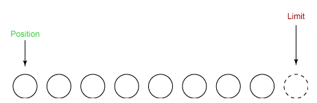
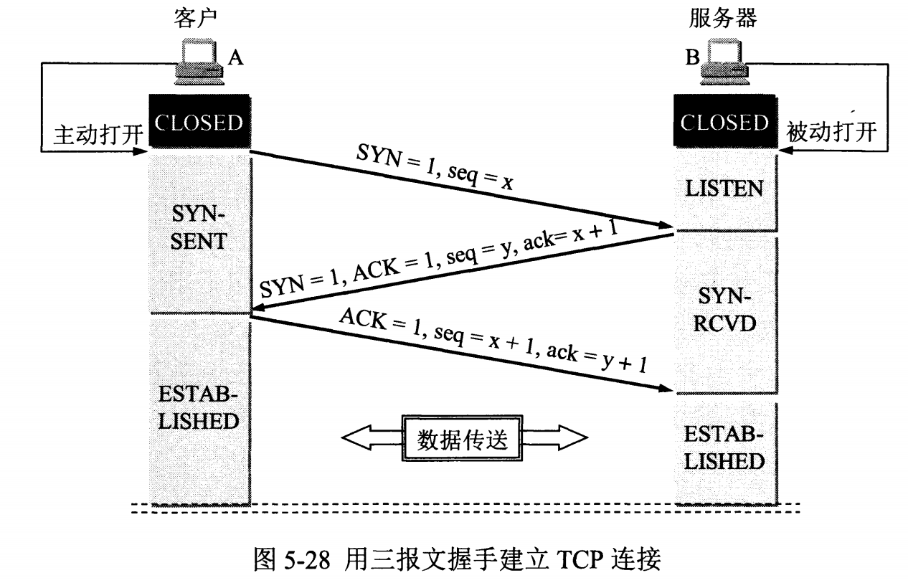

[TOC]

# JAVA基础

## 数据类型

| 基本类型 | 位   | 包装类型  | 默认值   | 缓存范围          |
| -------- | ---- | --------- | -------- | ----------------- |
| byte     | 8    | Byte      | 0        | 所有              |
| short    | 16   | Short     | 0        | -128~127          |
| int      | 32   | Integer   | 0        | -128~127          |
| long     | 64   | Long      | 0L       |                   |
| float    | 32   | Float     | 0.0f     |                   |
| double   | 64   | Double    | 0.0d     |                   |
| char     | 16   | Character | '\u0000' | '\u0000'~'\u007F' |
| boolean  |      |           | false    | true/false        |
| String   |      |           | null     |                   |

boolean 只有两个值：true、false，可以使用 1 bit 来存储，但是具体大小没有明确规定。JVM 会在编译时期将 boolean 类型的数据转换为 int，使用 1 来表示 true，0 表示 false。JVM 支持 boolean 数组，但是是通过读写 byte 数组来实现的。**因此，boolean变量是32位，boolean数组里每个占8位。**

## String

String被声明为final，不可被继承。（Integer等包装类也不能被继承）

Java 8中，使用char数组存储数据。

Java 9以后，使用byte数组存储数据，使用coder标识编码。

|               | 可变性 | 线程安全性         |
| ------------- | ------ | ------------------ |
| String        | 不可变 | 安全               |
| StringBuffer  | 可变   | 安全(synchronized) |
| StringBuilder | 可变   | 不安全             |

Java 7之前，String Pool被放在运行时常量池中，属于永久代。由于永久代的空间有限，在大量使用字符串的场景下会导致OutOfMemoryError错误。

Java 7开始，String Pool被移到堆中。

## BigDecimal

Java在java.math包中提供的API类BigDecimal，用来对超过16位有效位的数进行精确的运算。**Double.valueOf(String) 和Float.valueOf(String)会丢失精度。**

## switch

Java 5以前，判断条件只能使byte、short、char、int

Java 5开始，判断条件可以是枚举类型

Java 7开始，可以在switch条件判断语句中使用String对象。(内部实现使用的是字符串的hashcode)

## final

| 修饰对象 | 效果                                           |
| -------- | ---------------------------------------------- |
| 类       | 不能被继承                                     |
| 方法     | 不能被子类重写。private方法隐式地被指定为final |
| 基本类型 | 不能改变数值                                   |
| 引用类型 | 不能改变引用。被引用的对象本身可以被修改。     |

## static

| 修饰对象   | 属性                                                         |
| ---------- | ------------------------------------------------------------ |
| 静态变量   | 属于类，通过类名来访问                                       |
| 静态方法   | 属于类，只能访问静态变量和静态方法，不能是抽象方法，<br />方法中不能有this和super关键字 |
| 静态语句块 | 在类初始化时运行一次                                         |
| 静态内部类 | 不依赖于外部类的实例，不能访问外部类的非静态类的变量和方法   |

**初始化顺序：静态变量和静态语句块的初始化顺序取决于代码的顺序**

|      |                      |
| ---- | -------------------- |
| 父类 | 静态变量、静态语句块 |
| 子类 | 静态变量、静态语句块 |
| 父类 | 实例变量、普通语句块 |
| 父类 | 构造函数             |
| 子类 | 实例变量、普通语句块 |
| 子类 | 构造函数             |

## volatile

volatile 是一个**类型修饰符**。

- 保证了不同线程对这个变量进行操作时的可见性，即一个线程修改了某个变量的值，这新值对其他线程来说是立即可见的。（实现可见性）
- 禁止进行指令重排序。（实现有序性）
- volatile 只能保证对单次读/写的原子性。i++ 这种操作不能保证原子性。

volatile 变量的内存可见性是基于**内存屏障**（Memory Barrier）实现。

- 内存屏障，又称内存栅栏，是一个 CPU 指令。
- 在程序运行时，为了提高执行性能，编译器和处理器会对指令进行重排序，JMM 为了保证在不同的编译器和 CPU 上有相同的结果，通过插入特定类型的内存屏障来禁止特定类型的编译器重排序和处理器重排序，插入一条内存屏障会告诉编译器和 CPU：**不管什么指令都不能和这条 Memory Barrier 指令重排序**。

> JVM线程工作时的原子性指令有：
> 	read: 从主存读取一个变量的值的副本到线程的工作内存。
> 	load：read读来的值，把这个值填充到线程使用的变量中，然后就可以使用了。
> 	use：要使用一个变量，先发出这个指令。
> 	assign：赋值，给变量一个新值。
> 	write：将变量的新值运送到主存中。
> 	store：将写到主存的新值存到那个变量中。
>
> 上述操作必定是顺序执行的，但可不一定连续，中间可能插入其他指令。**为了保证可见性：关键就是保证load、use的执行顺序不被打乱(保证使用变量前一定进行了load操作，从主存拿最新值来)，assign、wirte的执行顺序不被打乱（保证赋值后马上就是把值写到主存）。**
>
> 所以使用内存屏障， CPU指令，可以禁止指令执行乱序：插入一个内存屏障， 相当于告诉CPU和编译器指令顺序先于这个指令的必须先执行，后于这个命令的必须后执行。
>
> 解决第一个导致不可见的因素（更新不及时）：内存屏障，对于volatile修饰的变量，读操作时在读指令**use**之**前**插入一条读屏障指令重新从主存加载最新值进来，保证了load、use指令的执行顺序不乱；写操作时在写指令**assign**之**后**插入一条写屏障指令，将工作内存变量的最新值立刻写入主存变量。
>
> 解决第二个因素（指令重排）： 由于读写数据时会在之前/后插入一条内存屏障指令，因此volatile可以禁止指令重排序。

## 权限

|           | 同包 | 子类 | 其他包 |
| --------- | ---- | ---- | ------ |
| public    | √    | √    | √      |
| protected | √    | √    | ×      |
| default   | √    | ×    | ×      |
| private   | ×    | ×    | ×      |


## Object通用方法

```java
public native int hashCode()

public boolean equals(Object obj)

protected native Object clone() throws CloneNotSupportedException

public String toString()

public final native Class<?> getClass()

// 垃圾回收时可被调用
protected void finalize() throws Throwable {}

// 下面5个都是用来线程同步的
public final native void notify()

public final native void notifyAll()

public final native void wait(long timeout) throws InterruptedException

public final void wait(long timeout, int nanos) throws InterruptedException

public final void wait() throws InterruptedException

```

### equals()

性值：自反性、对称性、传递性、一致性(多次调用结果不变)、与null比较结果都为false

基本类型：==判断值是否相等，没有equals()方法。

引用类型：==判断是否引用同一个对象，equals()判断值是否相等。

| 判断内容               | 结果                    |
| ---------------------- | ----------------------- |
| 是否为同一个对象的引用 | 如果是，直接返回true    |
| 是否是同一个类型       | 如果不是，直接返回false |
| 判断各个字段是否相等   |                         |

### hashCode()

定义：hashCode() 返回哈希值，而 equals() 是用来判断两个对象是否等价。

原因：计算哈希值具有随机性，两个值不同的对象可能计算出相同的哈希值。

结论：等价的两个对象散列值一定相同，但是散列值相同的两个对象不一定等价。

要求：在覆盖 equals() 方法时应当总是覆盖 hashCode() 方法，保证等价的两个对象哈希值也相等。

### toString()

默认返回 ToStringExample@4554617c 这种形式，其中 @ 后面的数值为散列码的无符号十六进制表示。

## 抽象类

抽象类和抽象方法都是用abstract关键字进行声明。如果一个类中包含抽象方法，那么这个类必须声明为抽象类。抽象类不能被实例化，只能被继承。

## 接口

Java 8开始，接口可以拥有默认的方法实现。接口的成员(字段和方法)默认都是public，并且不允许定义为private或者protected。接口本身的默认修饰符都是static和final。

## 重写

子类重写父类方法有三个限制：

- 子类方法的**访问权限**必须大于等于父类方法；
- 子类方法的**返回类型**必须是父类方法返回类型或为其子类型。
- 子类方法抛出的**异常类型**必须是父类抛出异常类型或为其子类型。

使用 @Override 注解，可以让编译器帮忙检查是否满足上面的三个限制条件。

## 反射

使用Class.forName()可以得到一个Class对象。

Class 和 java.lang.reflect 一起对反射提供了支持，java.lang.reflect 类库主要包含了以下三个类：

- **Field** ：可以使用 get() 和 set() 方法读取和修改 Field 对象关联的字段；
- **Method** ：可以使用 invoke() 方法调用与 Method 对象关联的方法；
- **Constructor** ：可以用 Constructor 的 newInstance() 创建新的对象。

**反射的优点：**

- **可扩展性** ：应用程序可以利用全限定名创建可扩展对象的实例，来使用来自外部的用户自定义类。
- **类浏览器和可视化开发环境** ：一个类浏览器需要可以枚举类的成员。可视化开发环境（如 IDE）可以从利用反射中可用的类型信息中受益，以帮助程序员编写正确的代码。
- **调试器和测试工具** ： 调试器需要能够检查一个类里的私有成员。测试工具可以利用反射来自动地调用类里定义的可被发现的 API 定义，以确保一组测试中有较高的代码覆盖率。

**反射的缺点：**

- **性能开销** ：反射涉及了动态类型的解析，所以 JVM 无法对这些代码进行优化。因此，反射操作的效率要比那些非反射操作低得多。我们应该避免在经常被执行的代码或对性能要求很高的程序中使用反射。
- **安全限制** ：使用反射技术要求程序必须在一个没有安全限制的环境中运行。
- **内部暴露** ：由于反射允许代码执行一些在正常情况下不被允许的操作（比如访问私有的属性和方法）。

## 异常


## 与C++的区别

- Java 是纯粹的面向对象语言，所有的对象都继承自 java.lang.Object，C++ 为了兼容 C 即支持面向对象也支持面向过程。
- Java 通过虚拟机从而实现跨平台特性，但是 C++ 依赖于特定的平台。
- Java 没有指针，它的引用可以理解为安全指针，而 C++ 具有和 C 一样的指针。
- Java 支持自动垃圾回收，而 C++ 需要手动回收。
- Java 不支持多重继承，只能通过实现多个接口来达到相同目的，而 C++ 支持多重继承。
- Java 不支持操作符重载，虽然可以对两个 String 对象执行加法运算，但是这是语言内置支持的操作，不属于操作符重载，而 C++ 可以。
- Java 的 goto 是保留字，但是不可用，C++ 可以使用 goto。

# JAVA 容器

## set

- TreeSet：基于**红黑树**实现，支持有序性操作，例如根据一个范围查找元素的操作。但是查找效率不如 HashSet，HashSet 查找的时间复杂度为 O(1)，TreeSet 则为 O(logN)。
- HashSet：基于**哈希表**实现，内部使用**HashMap**实现，支持快速查找，但不支持有序性操作。并且失去了元素的插入顺序信息，也就是说使用 Iterator 遍历 HashSet 得到的结果是不确定的。
- LinkedHashSet：具有 HashSet 的查找效率，并且内部使用**双向链表**维护元素的插入顺序

## List

- **ArrayList**：基于动态数组实现，支持随机访问，**线程不安全**。**扩容为1.5倍。默认大小为10。**modCount用来记录结构发生变化的次数，包括添加删除和调整大小。
- **Vector**：和 ArrayList 类似，但它是**线程安全**的。使用**synchronized**进行同步。扩容通过构造函数传入capacityIncrement参数以改变扩容增量大小，当其小于0时，**默认为扩容2倍。默认大小为10。**
- **LinkedList**：基于双向链表实现，只能顺序访问，但是可以快速地在链表中间插入和删除元素。不仅如此，LinkedList 还可以用作栈、队列和双向队列。

## Queue

- **LinkedList**：可以用它来实现双向队列。
- **PriorityQueue**：基于**堆结构**实现，可以用它来实现优先队列。

## Map

- **TreeMap**：基于**红黑树**实现。
- **HashMap**：基于**哈希表**实现。内部**Node类型**(继承自Map.Entry)或**TreeNode类型**(继承自LinkedHashMap.Entry)的数组table，允许插入键为null的键值对，使用第0个桶来存放。**默认容量为16。默认装载因子为0.75。每次扩容2倍**。JDK 1.8以后，链表长度大于等于8时变为红黑树，小于等于6时，变回链表。
- **HashTable**：和 HashMap 类似，但它是**线程安全**的。使用**synchronized**进行同步。**不可插入键位null的键值对**。**默认容量为11。扩容是2倍再加1。**
- **ConcurrentHashMap**： JDK 1.7引入了**分段锁**(Segment，继承自重入锁ReentrantLock)，每个分段所维护着几个桶。JDK 1.8使用的是优化的**synchronized** 关键字和**cas**操作了维护并发。
- **LinkedHashMap**：使用**双向链表来维护元素的顺序**，顺序为**插入顺序**或者最近最少使用（LRU）顺序。当一个节点被访问后，会将改节点移到链表尾部。

# JAVA 并发

## 线程

- 实现 Runnable 接口；实现run()方法。创建Thread实例，调用start()方法启动。
- 实现 Callable 接口；可以有返回值，通过FutureTask进行封装。
- 继承 Thread 类。实现run()方法。调用start()方法启动。

## 线程机制

**ThreadPoolExecutor参数**：

1. corePoolSize 线程池核心线程大小
2. maximumPoolSize 线程池最大线程数量
3. keepAliveTime 空闲线程存活时间
4. unit 空闲线程存活时间单位
5. workQueue 工作队列(阻塞队列)
   - **ArrayBlockingQueue**：基于数组的有界阻塞队列，创建时指定最大容量，按FIFO排序
   - **LinkedBlockingQuene**：基于链表的无界阻塞队列（其实最大容量为Interger.MAX），按照FIFO排序。
   - **SynchronousQuene**：一个不缓存任务的阻塞队列，生产者放入任务必须等到消费者取出这个任务。
   - **PriorityBlockingQueue**：具有优先级的无界阻塞队列，优先级通过参数Comparator实现。
6. threadFactory 线程工厂
7. handler 拒绝策略
   - CallerRunsPolicy：执行被拒绝任务的run方法
   - AbortPolicy：直接丢弃任务，并抛出RejectedExecutionException异常。
   - DiscardPolicy：直接丢弃任务，什么都不做。
   - DiscardOldestPolicy：抛弃进入队列最早的那个任务，然后尝试把这次拒绝的任务放入队列

### Daemon

当所有非守护线程结束时，程序也就终止，同时会杀死所有守护线程。

main() 属于非守护线程。

在线程启动之前使用 setDaemon() 方法可以将一个线程设置为守护线程。

### sleep()

Thread.sleep(millisec) 方法会休眠当前正在执行的线程，millisec 单位为毫秒。

sleep() 可能会抛出 InterruptedException，因为异常不能跨线程传播回 main() 中，因此必须在本地进行处理。线程中抛出的其它异常也同样需要在本地进行处理。

### yield()

对静态方法 Thread.yield() 的调用声明了当前线程已经完成了生命周期中最重要的部分，可以切换给其它线程来执行。该方法只是对线程调度器的一个建议，而且也只是建议具有相同优先级的其它线程可以运行。

## 互斥同步

**synchronized**：代码块，方法，类，静态方法。由JVM实现。不可中断。非公平。

**ReentrantLock**：是java.util.concurrent包中的锁。由JDK实现。可中断。默认情况下是非公平的。

## 线程协作

### join()

在线程中调用另一个线程的 join() 方法，会将当前线程挂起，而不是忙等待，直到目标线程结束。

### wait()、notify()、notifyAll()

调用 wait() 使得线程等待某个条件满足，线程在等待时会被挂起，当其他线程的运行使得这个条件满足时，其它线程会调用 notify() 或者 notifyAll() 来唤醒挂起的线程。

它们都属于 Object 的一部分，而不属于 Thread。

**只能用在同步方法或者同步控制块中使用**，否则会在运行时抛出 IllegalMonitorStateException。

使用 wait() 挂起期间，线程会释放锁。这是因为，如果没有释放锁，那么其它线程就无法进入对象的同步方法或者同步控制块中，那么就无法执行 notify() 或者 notifyAll() 来唤醒挂起的线程，造成死锁。

### wait() 和 sleep() 的区别

- wait() 是 Object 的方法，而 sleep() 是 Thread 的静态方法；
- wait() 会释放锁，sleep() 不会

### await()、signal()、signalAll()

java.util.concurrent 类库中提供了 Condition 类来实现线程之间的协调，可以在 Condition 上调用 await() 方法使线程等待，其它线程调用 signal() 或 signalAll() 方法唤醒等待的线程。

相比于 wait() 这种等待方式，await() 可以指定等待的条件，因此更加灵活。

使用 Lock 来获取一个 Condition 对象。

## 线程状态

- **新建(NEW)**：创建后尚未启动。调用start()函数后进入可运行状态。
- **可运行(RUNNABLE)**：Java线程中将就绪（ready）和运行中（running）两种状态统称为“运行”。线程对象创建后，其他线程(比如main线程）调用了该对象的start()方法。该状态的线程位于可运行线程池中，等待被线程调度选中，获取CPU的使用权，此时处于就绪状态（ready）。就绪状态的线程在获得CPU时间片后变为运行中状态（running）。
- **阻塞(BLOCKED)**：表示线程阻塞于锁。
- **等待(WAITING)**：等待其它线程显式地唤醒。调用Object.wait()方法进入。
- **超时等待(TIMED_WAITING)**：无需等待其它线程显式地唤醒，在一定时间之后会被系统自动唤醒。
- **终止(TERMINATED)**：表示该线程已经执行完毕，或者产生了异常而结束。

## 线程安全

### 不可变

不可变（Immutable）的对象一定是线程安全的，不需要再采取任何的线程安全保障措施。只要一个不可变的对象被正确地构建出来，永远也不会看到它在多个线程之中处于不一致的状态。多线程环境下，应当尽量使对象成为不可变，来满足线程安全。

不可变的类型：

- final 关键字修饰的基本数据类型
- String
- 枚举类型
- Number 部分子类，如 Long 和 Double 等数值包装类型，BigInteger 和 BigDecimal 等大数据类型。但同为 Number 的原子类 AtomicInteger 和 AtomicLong 则是可变的。

对于集合类型，可以使用 Collections.unmodifiableXXX() 方法来获取一个不可变的集合。

**互斥同步**：synchronized 和 ReentrantLock

### 非阻塞同步

互斥同步最主要的问题就是线程阻塞和唤醒所带来的性能问题，因此这种同步也称为阻塞同步。

**互斥同步(阻塞同步)**属于一种悲观的并发策略，总是认为只要不去做正确的同步措施，那就肯定会出现问题。无论共享数据是否真的会出现竞争，它都要进行加锁（这里讨论的是概念模型，实际上虚拟机会优化掉很大一部分不必要的加锁）、用户态核心态转换、维护锁计数器和检查是否有被阻塞的线程需要唤醒等操作。

随着硬件指令集的发展，我们可以使用基于冲突检测的乐观并发策略：先进行操作，如果没有其它线程争用共享数据，那操作就成功了，否则采取补偿措施（不断地重试，直到成功为止）。这种乐观的并发策略的许多实现都不需要将线程阻塞，因此这种同步操作称为**非阻塞同步**。

1. CAS

   乐观锁需要操作和冲突检测这两个步骤具备原子性，这里就不能再使用互斥同步来保证了，只能靠硬件来完成。硬件支持的原子性操作最典型的是：比较并交换（Compare-and-Swap，CAS）。CAS 指令需要有 3 个操作数，分别是内存地址 V、旧的预期值 A 和新值 B。当执行操作时，只有当 V 的值等于 A，才将 V 的值更新为 B。

2. AtomicInteger

   J.U.C 包里面的整数原子类 AtomicInteger 的方法调用了 Unsafe 类的 CAS 操作。

3. ABA

   如果一个变量初次读取的时候是 A 值，它的值被改成了 B，后来又被改回为 A，那 CAS 操作就会误认为它从来没有被改变过。

   J.U.C 包提供了一个带有标记的原子引用类 AtomicStampedReference 来解决这个问题，它可以通过控制变量值的版本来保证 CAS 的正确性。大部分情况下 ABA 问题不会影响程序并发的正确性，如果需要解决 ABA 问题，改用传统的互斥同步可能会比原子类更高效。

## 无同步方案

1. **栈封闭**：多个线程访问同一个方法的局部变量时，不会出现线程安全问题，因为局部变量存储在虚拟机栈中，属于线程私有的。

2. **线程本地存储**(Thread Local Storage)：可以使用 java.lang.ThreadLocal 类来实现线程本地存储功能。

   当调用一个 ThreadLocal 的 set(T value) 方法时，先得到当前线程的 ThreadLocalMap 对象，然后将 ThreadLocal->value 键值对插入到该 Map 中。

3. **可重入代码**(Reentrant Code)：这种代码也叫做纯代码（Pure Code），可以在代码执行的任何时刻中断它，转而去执行另外一段代码（包括递归调用它本身），而在控制权返回后，原来的程序不会出现任何错误。

## 锁优化

主要指JVM对synchronized的优化。

### 自旋锁

互斥同步进入阻塞状态的开销都很大，应该尽量避免。在许多应用中，共享数据的锁定状态只会持续很短的一段时间。自旋锁的思想是让一个线程在请求一个共享数据的锁时执行忙循环（自旋）一段时间，如果在这段时间内能获得锁，就可以避免进入阻塞状态。

自旋锁虽然能避免进入阻塞状态从而减少开销，但是它需要进行忙循环操作占用 CPU 时间，它只适用于共享数据的锁定状态很短的场景。

在 JDK 1.6 中引入了自适应的自旋锁。自适应意味着自旋的次数不再固定了，而是由前一次在同一个锁上的自旋次数及锁的拥有者的状态来决定。

### 锁消除

锁消除是指对于被检测出不可能存在竞争的共享数据的锁进行消除。

锁消除主要是通过逃逸分析来支持，如果堆上的共享数据不可能逃逸出去被其它线程访问到，那么就可以把它们当成私有数据对待，也就可以将它们的锁进行消除。

对于一些看起来没有加锁的代码，其实隐式的加了很多锁。

### 锁粗化

如果一系列的连续操作都对同一个对象反复加锁和解锁，频繁的加锁操作就会导致性能损耗。如果虚拟机探测到由这样的一串零碎的操作都对同一个对象加锁，将会把加锁的范围扩展（粗化）到整个操作序列的外部。

### 轻量级锁

JDK 1.6 引入了偏向锁和轻量级锁，从而让锁拥有了四个状态：**无锁状态**（unlocked）、**偏向锁状态**（biasble）、**轻量级锁状态**（lightweight locked）**和重量级锁状态**（inflated）。

轻量级锁是相对于传统的重量级锁而言，它使用 CAS 操作来避免重量级锁使用互斥量的开销。对于绝大部分的锁，在整个同步周期内都是不存在竞争的，因此也就不需要都使用互斥量进行同步，可以先采用 CAS 操作进行同步，如果 CAS 失败了再改用互斥量进行同步。

当尝试获取一个锁对象时，如果锁对象标记为 0 01，说明锁对象的锁未锁定（unlocked）状态。此时虚拟机在当前线程的虚拟机栈中创建 Lock Record，然后使用 CAS 操作将对象的 Mark Word 更新为 Lock Record 指针。如果 CAS 操作成功了，那么线程就获取了该对象上的锁，并且对象的 Mark Word 的锁标记变为 00，表示该对象处于轻量级锁状态。

如果 CAS 操作失败了，虚拟机首先会检查对象的 Mark Word 是否指向当前线程的虚拟机栈，如果是的话说明当前线程已经拥有了这个锁对象，那就可以直接进入同步块继续执行，否则说明这个锁对象已经被其他线程线程抢占了。**如果有两条以上的线程争用同一个锁，那轻量级锁就不再有效，要膨胀为重量级锁。**

### 偏向锁

偏向锁的思想是偏向于让第一个获取锁对象的线程，这个线程在之后获取该锁就不再需要进行同步操作，甚至连 CAS 操作也不再需要。

当**锁对象第一次被线程获得的时候，进入偏向状态**，标记为 1 01。同时使用 CAS 操作将线程 ID 记录到 Mark Word 中，如果 CAS 操作成功，这个线程以后每次进入这个锁相关的同步块就不需要再进行任何同步操作。

当有另外一个线程去尝试获取这个锁对象时，偏向状态就宣告结束，此时撤销偏向（Revoke Bias）后恢复到未锁定状态或者轻量级锁状态。

# JAVA 虚拟机

## 运行时数据区域

1. **程序计数器**：记录正在执行的虚拟机字节码指令的地址（如果正在执行的是本地方法则为空）。

2. **Java虚拟机栈**：每个Java方法在执行的同时会创建一个栈帧用于存储**局部变量表，操作数栈，常量池引用**等信息。从方法调用开始执行完成的过程，对应着一个栈帧在Java虚拟机栈中入栈和出栈的过程。

   可以通过-**Xss**这个虚拟机参数来指定每个线程的Java虚拟机栈内存大小，在JDK 1.4中用作256K，而在JDK 1.5+默认为1M

   该区域可能引发以下异常：

   - 当线程请求的栈深度超过最大值，会引发StackOverflowError异常；
   - 栈进行动态扩展时如果无法申请到足够的内存，会抛出OutOfMemoryError异常。

3. **本地方法栈**：本地方法栈与Java虚拟机栈类似，它们之间的区别只不过是**本地方法栈为本地方法服务**。

   本地方法一般是用其他语言（C，C++或汇编语言等）编写的，并且被编译为基于本机硬件和操作系统的程序，应对这些方法需要特别处理。

4. **堆**：**所有对象**都在这里分配内存，是垃圾收集的主要区域（“ GC堆”）。

   现代的垃圾收集器基本都是采用**分代收集算法**，其主要的思想是针对不同类型的对象采用不同的垃圾回收算法。可以将堆分成两块：

   - 新生代（Young Generation）
   - 老年代（Old Generation）

   堆不需要连续内存，并且可以动态增加其内存，增加失败会引发OutOfMemoryError异常。

   可以通过-**Xms**和-**Xmx**这两个虚拟机参数来指定一个程序的堆内存大小，第一个参数设置初始值，第二个参数设置最大值。

   **-Xmn** 年轻代大小（整个JVM内存大小 = 年轻代 + 年老代 + 永久代）。

   **-XX:SurvivorRatio**设置年轻代中Eden区与Survivor区的比值。默认为8。

5. **方法区**：用于存放已被加载的**类信息**，**常量**，**静态变量**，即时编译器编译后的代码等数据。

   和堆一样不需要连续的内存，并且可以动态扩展，动态扩展失败一样会抛出OutOfMemoryError异常。

   对这块区域进行垃圾回收的主要目标是对常量池的回收和对类的卸载，但是一般比较难实现。

   HotSpot虚拟机把它当成永久代来进行垃圾回收。但很难确定永久代的大小，因为它遇到很多因素影响，并且每次Full GC之后永久代的大小都会改变，所以经常会引发OutOfMemoryError异常。为了更容易管理方法区，从JDK 1.8开始，可移除永久代，并把方法区移至元空间，它位于本地内存中，而不是虚拟机内存中。

   在JDK 1.8之后，原来永久代的数据被分到了堆和元空间中。**元空间存储类的元信息，静态变量和常量池等放入堆中。**

6. **运行时常量池**：运行时常量池是方法区的一部分。

   类文件中的常量池（编译器生成的字面量和符号引用）会在类加载后被放入这个区域。

   除了在编译期生成的常量，还允许动态生成，例如String类的intern()。

7. **直接内存**：在JDK 1.4中新发布了NIO类，它可以使用Native函数库直接分配堆外部内存，然后通过Java堆里的DirectByteBuffer对象作为这块内存的引用进行操作。这样能在一些场景中显着提高性能，因为避免了在堆内存和堆外内存来回拷贝数据。

## 垃圾收集

程序计数器，虚拟机栈和本地方法栈这三个区域属于线程私有的，只存在于线程的生命周期内，线程结束之后就会消失，因此不需要对这三个区域进行垃圾回收。

### 引用计数算法

为对象添加一个引用计数器，当对象增加一个引用时计数器加1，引用重置时计数器减1。引用计数为0的对象可被回收。

在两个对象出现循环引用的情况下，此时引用计数器永远不为0，导致无法对它们进行回收。正是因为循环引用的存在，因此Java虚拟机不使用引用计数算法。

### 可达性分析算法

以GC根为起点，进行搜索，可达的对象都是幸存的，不可达的对象可被回收。

Java虚拟机使用该算法来判断对象是否可被回收，GC根目录一般包含以下内容：

- 虚拟机栈中局部变量表中引用的对象
- 本地方法栈中JNI中引用的对象
- 方法区中类静态属性引用的对象
- 方法区中的常量引用的对象

### 方法区的回收

因为方法区主要存放永久代对象，而永久代对象的回收率比新生代低很多，所以在方法区上进行回收性价比不高。

主要是对常量池的回收和对类的卸载。

为了避免内存溢出，在大量使用反射和动态代理的场景都需要虚拟机替代类卸载功能。

类的卸载条件很多，需要满足以下三个条件，并且满足了条件也不一定会被卸载：

- 该类所有的实例都已经被回收，此时堆中不存在该类的任何实例。
- 加载该类的ClassLoader已经被回收。
- 该类对应的Class对象没有在任何地方被引用，也就无法在任何地方通过反射访问该类方法。

### finalize()

但是try-finally等方式可以做得更好，并且该方法运行代价很高，不确定性大，无法保证各个对象的调用顺序，因此最好不要使用。

当一个对象可被回收时，如果需要执行该对象的finalize()方法，那么就有可能在该方法中让对象重新引用，从而实现自救。自救只能进行一次，如果回收的对象之前调用了finalize()方法自救，后面回收时不会再调用该方法。

## 引用类型

1. **强引用**：被强引用关联的对象不会被回收。使用new一个新对象的方式来创建强引用。

2. **软引用**：被软引用关联的对象只有在内存不足的情况下才会被回收。使用`SoftReference`类来创建软引用。

3. **弱引用**：被弱引用关联的对象一定会被回收，实际上它只能存活到下一次垃圾回收发生之前。使用`WeakReference`类来创建弱引用。

4. **虚引用**：又称为幽灵引用或幻影引用，一个对象是否有虚引用的存在，不会对生存时间造成影响，也无法通过虚引用得到一个对象。

   为一个对象设置虚引用的唯一目的是能在这个对象被回收时收到一个系统通知。

   使用`PhantomReference`来创建虚引用。

## 垃圾收集算法

1. **标记-清除**：在标记阶段，程序会检查每个对象是否为活动对象，如果是活动对象，则程序会在对象头部打上标记。

   在清除阶段，会进行对象回收并取消标志位，另外，还要判断回收后的分块与前一个局部分块是否连续，若连续，会合并这两个分块。回收对象就是把对象作为分块，连接到被称为“空闲链表”的单向链表，之后进行分配时只需要遍历这个空闲链表，就可以找到分块。

   如果它找到的块等于size，会直接返回这个分块；如果找到的块大于size，可以块分割成大小为size与（block-size）的两部分，返回大小为size的分块，并把大小为（block-size）的块返回给空闲链表。

   不足：

   - 标记和清除过程效率都不高；
   - 会产生大量不连续的内存碎片，导致无法给大对象分配内存。

2. **标记-整理**：让所有存活的对象都向一端移动，然后直接清理掉端边界以外的内存。

   优点：

   - 不会产生内存碎片

   不足：

   - 需要移动大量对象，处理效率比较低。

3. **复制**：将内存划分为大小不同的两块，每次只使用其中一块，当这一块内存用完了就将仍存活的对象复制到另一块上面，然后再把使用过的内存空间进行一次清理。

   主要不足是只使用了内存的一半。

   现在的商业虚拟机都采用这种收集算法回收新生代，但并非划分为大小改变的两块，而是一块相连的Eden空间和两块较小的幸存者空间，每次使用Eden和其中一块在回收时，将Eden和Survivor中还存活着的对象全部复制到另一块Survivor上，最后清理Eden和使用过的那一块Survivor。

   HotSpot虚拟机的Eden和Survivor大小比例最小为8：1，保证了内存的利用率达到90％。如果每次回收有多于10％的对象存活，那么一块Survivor就不够用了，此时需要依赖于老年代进行空间分配担保，也就是借用老年代的空间存储放不下的对象。

4. **分代收集**：现在的商业虚拟机采用分代收集算法，它根据对象存活周期将内存划分为几块，不同块采用适当的收集算法。

   一般将堆分为新生代和老年代。

   - 新生代使用：复制算法
   - 老年代使用：标记-清除或标记-整理算法

## 垃圾收集器


以上是HotSpot虚拟机中的7个垃圾收集器，连线表示垃圾收集器可以配合使用。

- 单线程与多线程：单线程指的是垃圾收集器只使用一个线程，而多线程使用多个线程；
- 串行与并行：串行指的是垃圾收集器与用户程序交替执行，这意味着在执行垃圾收集的时候需要停顿用户程序；并行指的是垃圾收集器和用户程序同时执行。之外，其他垃圾收集器都是以串行的方式执行。

1. **Serial收集器**：Serial翻译为串行，初始它以串行的方式执行。**单线程复制**。

   它是单线程的收集器，只会使用一个线程进行垃圾收集工作。

   它的优点是简单高效，在单独的CPU环境下，由于没有线程交互的开销，因此拥有最高的单线程收集效率。

   它是客户场景的下一个替代新生代收集器，是一个**复制收集器**，因为在该场景下的内存一般来说不会很大。它收集一两百兆垃圾的停顿时间可以控制在一百多几十以内，只要不是太替换，这点停顿时间是可以接受的。

2. **ParNew收集器**：它是Serial收集器的多线程版本。**多线程复制**。

   它是服务器场景下最小的新生代收集器，除了性能原因外，主要是因为除了串行收集器，只有它能与CMS收集器配合使用。

3. **Parallel Scavenge清理器**：**标记-复制-清除**。与ParNew一样是多线程收集器。**多线程复制高效**。

   其它收集器目标是尽可能缩短垃圾收集时用户线程的停顿时间，而它的目标是达到一个可控制的吞吐量，因此它被称为“**吞吐量优先**”收集器。这里的吞吐量指 CPU 用于运行用户程序的时间占总时间的比值。

   停顿时间越短就越适合需要与用户交互的程序，良好的响应速度能提升用户体验。而高吞吐量则可以高效率地利用 CPU 时间，尽快完成程序的运算任务，适合在后台运算而不需要太多交互的任务。

   缩短停顿时间是以牺牲吞吐量和新生代空间来换取的：新生代空间变小，垃圾回收变得频繁，导致吞吐量下降。

   可以通过一个开关参数打开 GC 自适应的调节策略（GC Ergonomics），就不需要手工指定新生代的大小（-Xmn）、Eden 和 Survivor 区的比例、晋升老年代对象年龄等细节参数了。虚拟机会根据当前系统的运行情况收集性能监控信息，动态调整这些参数以提供最合适的停顿时间或者最大的吞吐量。

4. **Serial Old收集器**：是 Serial 收集器的老年代版本，也是给 Client 场景下的虚拟机使用。**单线程整理**。如果用在 Server 场景下，它有两大用途：

   - 在 JDK 1.5 以及之前版本（Parallel Old 诞生以前）中与 Parallel Scavenge 收集器搭配使用。
   - 作为 CMS 收集器的后备预案，在并发收集发生 Concurrent Mode Failure 时使用。

5. **Parallel Old收集器**：**标记-整理-清除**。是 Parallel Scavenge 收集器的老年代版本。**多线程整理**。

   在注重吞吐量以及 CPU 资源敏感的场合，都可以优先考虑 Parallel Scavenge 加 Parallel Old 收集器。

6. **CMS收集器**：CMS（Concurrent Mark Sweep），Mark Sweep 指的是**标记 - 清除**算法。目标是**避免长时间的暂停**。

   分为以下四个流程：

   - 初始标记：仅仅只是标记一下 GC Roots 能直接关联到的对象，速度很快，需要停顿。
   - 并发标记：进行 GC Roots Tracing 的过程，它在整个回收过程中耗时最长，不需要停顿。
   - 重新标记：为了修正并发标记期间因用户程序继续运作而导致标记产生变动的那一部分对象的标记记录，需要停顿。
   - 并发清除：不需要停顿。

   在整个过程中耗时最长的并发标记和并发清除过程中，收集器线程都可以与用户线程一起工作，不需要进行停顿。

   具有以下缺点：

   - 吞吐量低：低停顿时间是以牺牲吞吐量为代价的，导致 CPU 利用率不够高。
   - 无法处理浮动垃圾，可能出现 Concurrent Mode Failure。浮动垃圾是指并发清除阶段由于用户线程继续运行而产生的垃圾，这部分垃圾只能到下一次 GC 时才能进行回收。由于浮动垃圾的存在，因此需要预留出一部分内存，意味着 CMS 收集不能像其它收集器那样等待老年代快满的时候再回收。如果预留的内存不够存放浮动垃圾，就会出现 Concurrent Mode Failure，这时虚拟机将临时启用 Serial Old 来替代 CMS。
   - 标记 - 清除算法导致的空间碎片，往往出现老年代空间剩余，但无法找到足够大连续空间来分配当前对象，不得不提前触发一次 Full GC。

7. **G1收集器**：G1（Garbage-First），它是一款面向服务端应用的垃圾收集器，在多 CPU 和大内存的场景下有很好的性能。HotSpot 开发团队赋予它的使命是未来可以替换掉 CMS 收集器。

   堆被分为新生代和老年代，其它收集器进行收集的范围都是整个新生代或者老年代，而 G1 可以直接对新生代和老年代一起回收。

   G1 把堆划分成多个大小相等的独立区域（Region），新生代和老年代不再物理隔离。

   通过引入 Region 的概念，从而将原来的一整块内存空间划分成多个的小空间，使得每个小空间可以单独进行垃圾回收。这种划分方法带来了很大的灵活性，使得可预测的停顿时间模型成为可能。通过记录每个 Region 垃圾回收时间以及回收所获得的空间（这两个值是通过过去回收的经验获得），并维护一个优先列表，每次根据允许的收集时间，优先回收价值最大的 Region。

   每个 Region 都有一个 Remembered Set，用来记录该 Region 对象的引用对象所在的 Region。通过使用 Remembered Set，在做可达性分析的时候就可以避免全堆扫描。

   如果不计算维护 Remembered Set 的操作，G1 收集器的运作大致可划分为以下几个步骤：

   - 初始标记
   - 并发标记
   - 最终标记：为了修正在并发标记期间因用户程序继续运作而导致标记产生变动的那一部分标记记录，虚拟机将这段时间对象变化记录在线程的 Remembered Set Logs 里面，最终标记阶段需要把 Remembered Set Logs 的数据合并到 Remembered Set 中。这阶段需要停顿线程，但是可并行执行。
   - 筛选回收：首先对各个 Region 中的回收价值和成本进行排序，根据用户所期望的 GC 停顿时间来制定回收计划。此阶段其实也可以做到与用户程序一起并发执行，但是因为只回收一部分 Region，时间是用户可控制的，而且停顿用户线程将大幅度提高收集效率。

   具备如下特点：

   - 空间整合：整体来看是基于“标记 - 整理”算法实现的收集器，从局部（两个 Region 之间）上来看是基于“复制”算法实现的，这意味着运行期间不会产生内存空间碎片。
   - 可预测的停顿：能让使用者明确指定在一个长度为 M 毫秒的时间片段内，消耗在 GC 上的时间不得超过 N 毫秒。

## Minor GC 与 Full GC

- Minor GC：回收新生代，因为新生代对象存活时间很短，因此 Minor GC 会频繁执行，执行的速度一般也会比较快。
- Full GC：回收老年代和新生代，老年代对象其存活时间长，因此 Full GC 很少执行，执行速度会比 Minor GC 慢很多。

## 内存分配策略

1. **对象优先在Eden分配**：大多数情况下，对象在新生代 Eden 上分配，当 Eden 空间不够时，发起 Minor GC。

2. **大对象直接进入老年代**：大对象是指需要连续内存空间的对象，最典型的大对象是那种很长的字符串以及数组。

   经常出现大对象会提前触发垃圾收集以获取足够的连续空间分配给大对象。

   **-XX:PretenureSizeThreshold**，大于此值的对象直接在老年代分配，避免在 Eden 和 Survivor 之间的大量内存复制。

3. **长期存活的对象进入老年代**：为对象定义年龄计数器，对象在 Eden 出生并经过 Minor GC 依然存活，将移动到 Survivor 中，年龄就增加 1 岁，增加到一定年龄则移动到老年代中。

   **-XX:MaxTenuringThreshold** 用来定义年龄的阈值，默认为15。

4. **动态对象年龄判定**：虚拟机并不是永远要求对象的年龄必须达到 MaxTenuringThreshold 才能晋升老年代，如果在 **Survivor 中相同年龄所有对象大小的总和大于 Survivor 空间的一半**，则年龄大于或等于该年龄的对象可以直接进入老年代，无需等到 MaxTenuringThreshold 中要求的年龄。

5. **空间分配担保**：在发生 Minor GC 之前，虚拟机先检查**老年代最大可用的连续空间是否大于新生代所有对象总空间**，如果条件成立的话，那么 Minor GC 可以确认是安全的。

   如果不成立的话虚拟机会查看 **HandlePromotionFailure** 的值是否允许担保失败，如果允许那么就会继续检查老年代最大可用的连续空间是否大于历次晋升到老年代对象的平均大小，如果大于，将尝试着进行一次 Minor GC；如果小于，或者 HandlePromotionFailure 的值不允许冒险，那么就要进行一次 Full GC。

## Full GC的触发条件

Minor GC，其触发条件非常简单，当 Eden 空间满时，就将触发一次 Minor GC。

1. **调用System.gc()**：只是建议虚拟机执行 Full GC，但是虚拟机不一定真正去执行。实际上调用的是System.getRuntime().gc()

2. **老年代空间不足**：老年代空间不足的常见场景为前文所讲的大对象直接进入老年代、长期存活的对象进入老年代等。

   为了避免以上原因引起的 Full GC，应当尽量不要创建过大的对象以及数组。除此之外，可以通过 -Xmn 虚拟机参数调大新生代的大小，让对象尽量在新生代被回收掉，不进入老年代。还可以通过 -XX:MaxTenuringThreshold 调大对象进入老年代的年龄，让对象在新生代多存活一段时间。

3. **空间分配担保失败**：使用复制算法的 Minor GC 需要老年代的内存空间作担保，如果担保失败会执行一次 Full GC。

4. **JDK 1.7及以前的永久代空间不足**：在 JDK 1.7 及以前，HotSpot 虚拟机中的方法区是用永久代实现的，永久代中存放的为一些 Class 的信息、常量、静态变量等数据。

   当系统中要加载的类、反射的类和调用的方法较多时，永久代可能会被占满，在未配置为采用 CMS GC 的情况下也会执行 Full GC。如果经过 Full GC 仍然回收不了，那么虚拟机会抛出 java.lang.OutOfMemoryError。

   为避免以上原因引起的 Full GC，可采用的方法为增大永久代空间或转为使用 CMS GC。

5. **Concurrent Mode Failure**：执行 CMS GC 的过程中同时有对象要放入老年代，而此时老年代空间不足（可能是 GC 过程中浮动垃圾过多导致暂时性的空间不足），便会报 Concurrent Mode Failure 错误，并触发 Full GC。

## 类加载机制

**类的生命周期**：加载(Loading)，验证(Verification)，准备(Preparation)，解析(Resolution)，初始化(Initialization)，使用(Using)，卸载(Unloading)

**类加载过程**：加载，验证，准备，解析，初始化

1.**加载**：加载过程完成以下三件事：

- 通过类的完全限定名称获取定义该类的二进制字节流。
- 将该字节流表示的静态存储结构转换为方法区的运行时存储结构。
- 在内存中生成一个代表该类的 Class 对象，作为方法区中该类各种数据的访问入口。

其中二进制字节流可以从以下方式中获取：

- 从 ZIP 包读取，成为 JAR、EAR、WAR 格式的基础。
- 从网络中获取，最典型的应用是 Applet。
- 运行时计算生成，例如动态代理技术，在 java.lang.reflect.Proxy 使用 ProxyGenerator.generateProxyClass 的代理类的二进制字节流。
- 由其他文件生成，例如由 JSP 文件生成对应的 Class 类。

2. **验证**：确保 Class 文件的字节流中包含的信息符合当前虚拟机的要求，并且不会危害虚拟机自身的安全。

3. **准备**：类变量是被 static 修饰的变量，准备阶段**为类变量分配内存并设置初始值**，使用的是**方法区的内存**。

   实例变量不会在这阶段分配内存，它会在对象实例化时随着对象一起被分配在堆中。应该注意到，实例化不是类加载的一个过程，类加载发生在所有实例化操作之前，并且类加载只进行一次，实例化可以进行多次。

   初始值一般为 0 值。

   如果类变量是常量，那么它将初始化为表达式所定义的值而不是 0。

4. **解析**：将常量池的符号引用替换为直接引用的过程。

   其中解析过程在某些情况下可以在初始化阶段之后再开始，这是为了支持 Java 的动态绑定

5. **初始化**：初始化阶段才真正开始执行类中定义的 Java 程序代码。初始化阶段是**虚拟机执行类构造器 <clinit>() 方法的过程**。在准备阶段，类变量已经赋过一次系统要求的初始值，而在初始化阶段，根据程序员通过程序制定的主观计划去初始化类变量和其它资源。

   <clinit>() 是由编译器自动收集类中所有类变量的赋值动作和静态语句块中的语句合并产生的，编译器收集的顺序由语句在源文件中出现的顺序决定。特别注意的是，静态语句块只能访问到定义在它之前的类变量，定义在它之后的类变量只能赋值，不能访问。

   接口中不可以使用静态语句块，但仍然有类变量初始化的赋值操作，因此接口与类一样都会生成 <clinit>() 方法。但接口与类不同的是，执行接口的 <clinit>() 方法不需要先执行父接口的 <clinit>() 方法。**只有当父接口中定义的变量使用时，父接口才会初始化。**另外，接口的实现类在初始化时也一样不会执行接口的 <clinit>() 方法。

   虚拟机会保证一个类的 <clinit>() 方法在多线程环境下被正确的加锁和同步，如果多个线程同时初始化一个类，只会有一个线程执行这个类的 <clinit>() 方法，其它线程都会阻塞等待，直到活动线程执行 <clinit>() 方法完毕。如果在一个类的 <clinit>() 方法中有耗时的操作，就可能造成多个线程阻塞，在实际过程中此种阻塞很隐蔽。

## 类初始化时机

1. **主动引用**：虚拟机规范中并没有强制约束何时进行加载，但是规范严格规定了有且只有下列五种情况必须对类进行初始化（加载、验证、准备都会随之发生）：
   - 遇到 **new、getstatic、putstatic、invokestatic** 这四条字节码指令时，如果类没有进行过初始化，则必须先触发其初始化。最常见的生成这 4 条指令的场景是：使用 new 关键字实例化对象的时候；读取或设置一个类的静态字段（被 final 修饰、已在编译期把结果放入常量池的静态字段除外）的时候；以及调用一个类的静态方法的时候。
   - 使用 java.lang.reflect 包的方法对类进行**反射调用**的时候，如果类没有进行初始化，则需要先触发其初始化。
   - 当初始化一个类的时候，如果发现其父类还没有进行过初始化，则需要先触发其**父类的初始化**。
   - 当虚拟机启动时，用户需要指定一个要执行的主类（包含 main() 方法的那个类），虚拟机会先**初始化主类**；
   - 当使用 JDK 1.7 的动态语言支持时，如果一个 java.lang.invoke.MethodHandle 实例最后的解析结果为 REF_getStatic, REF_putStatic, REF_invokeStatic 的方法句柄，并且这个方法句柄所对应的类没有进行过初始化，则需要先触发其初始化；
2. **被动引用**：被动引用不会触发初始化。
   - 通过子类**引用父类的静态字段**，不会导致子类初始化。
   - 通过数组定义来引用类，不会触发此类的初始化。该过程会对**数组类进行初始化**，数组类是一个由虚拟机自动生成的、直接继承自 Object 的子类，其中包含了数组的属性和方法。
   - 常量在编译阶段会存入调用类的常量池中，本质上并没有直接引用到定义常量的类，因此**不会触发定义常量的类的初始化**。

## 类与类加载器

两个类相等，需要类本身相等，并且使用同一个类加载器进行加载。这是因为每一个类加载器都拥有一个独立的类名称空间。

这里的相等，包括类的 Class 对象的 equals() 方法、isAssignableFrom() 方法、isInstance() 方法的返回结果为 true，也包括使用 instanceof 关键字做对象所属关系判定结果为 true。

## 类加载器分类

从 Java 虚拟机的角度来讲，只存在以下两种不同的类加载器：

- 启动类加载器（Bootstrap ClassLoader），使用 C++ 实现，是虚拟机自身的一部分；
- 所有其它类的加载器，使用 Java 实现，独立于虚拟机，继承自抽象类 java.lang.ClassLoader。

从 Java 开发人员的角度看，类加载器可以划分得更细致一些：

- **启动类加载器**（Bootstrap ClassLoader）此类加载器负责将存放在 **<JRE_HOME>\lib** 目录中的，或者被 **-Xbootclasspath** 参数所指定的路径中的，并且是虚拟机识别的（仅按照文件名识别，如 rt.jar，**名字不符合的类库即使放在 lib 目录中也不会被加载**）类库加载到虚拟机内存中。启动类加载器无法被 Java 程序直接引用，用户在编写自定义类加载器时，如果需要把加载请求委派给启动类加载器，直接使用 null 代替即可。
- **扩展类加载器**（Extension ClassLoader）这个类加载器是由 ExtClassLoader（sun.misc.Launcher$ExtClassLoader）实现的。它负责将 **<JAVA_HOME>/lib/ext** 或者被 **java.ext.dir** 系统变量所指定路径中的所有类库加载到内存中，开发者可以直接使用扩展类加载器。
- **应用程序类加载器**（Application ClassLoader）这个类加载器是由 AppClassLoader（sun.misc.Launcher$AppClassLoader）实现的。由于这个类加载器是 ClassLoader 中的 getSystemClassLoader() 方法的返回值，因此一般称为**系统类加载器**。它负责加载用户类路径（**ClassPath**）上所指定的类库，开发者可以直接使用这个类加载器，如果应用程序中没有自定义过自己的类加载器，**一般情况下这个就是程序中默认的类加载器**。

## 双亲委派模型

应用程序是由三种类加载器互相配合从而实现类加载，除此之外还可以加入自己定义的类加载器。除了顶层的启动类加载器外，其它的类加载器都要有自己的父类加载器。这里的父子关系一般通过**组合关系**（Composition）来实现，而不是继承关系（Inheritance）。

1. **工作过程**：一个类加载器首先将类加载请求转发到父类加载器，只有当父类加载器无法完成时才尝试自己加载。

2. **好处**：使得 Java 类随着它的类加载器一起具有一种带有优先级的层次关系，从而使得基础类得到统一。

   例如 java.lang.Object 存放在 rt.jar 中，如果编写另外一个 java.lang.Object 并放到 ClassPath 中，程序可以编译通过。由于双亲委派模型的存在，所以在 rt.jar 中的 Object 比在 ClassPath 中的 Object 优先级更高，这是因为 rt.jar 中的 Object 使用的是启动类加载器，而 ClassPath 中的 Object 使用的是应用程序类加载器。rt.jar 中的 Object 优先级更高，那么程序中所有的 Object 都是这个 Object。

3. **实现**：以抽象类 java.lang.ClassLoader 的 loadClass() 方法运行过程如下：先检查类是否已经加载过，如果没有则让父类加载器去加载。当父类加载器加载失败时抛出ClassNotFoundException，此时尝试自己去加载。

## 自定义类加载器实现

 FileSystemClassLoader 是自定义类加载器，继承自 java.lang.ClassLoader，用于加载文件系统上的类。它首先根据类的全名在文件系统上查找类的字节代码文件（.class 文件），然后读取该文件内容，最后通过 defineClass() 方法来把这些字节代码转换成 java.lang.Class 类的实例。

java.lang.ClassLoader 的 loadClass() 实现了双亲委派模型的逻辑，自定义类加载器一般不去重写它，但是需要重写 **findClass()**法。

## Tomcat的类加载器

- **commonLoader**：Tomcat最基本的类加载器，加载路径中的class可以被Tomcat容器本身以及各个Webapp访问；
- **catalinaLoader**：Tomcat容器私有的类加载器，加载路径中的class对于Webapp不可见；
- **sharedLoader**：各个Webapp共享的类加载器，加载路径中的class对于所有Webapp可见，但是对于Tomcat容器不可见；
- **WebappClassLoader**：各个Webapp私有的类加载器，加载路径中的class只对当前Webapp可见；	

# JAVA I/O

Java 的 I/O 大概可以分成以下几类：

- 磁盘操作：File
- 字节操作：InputStream 和 OutputStream
- 字符操作：Reader 和 Writer
- 对象操作：Serializable
- 网络操作：Socket
- 新的输入/输出：NIO

## 磁盘操作

File 类可以用于表示文件和目录的信息，但是它不表示文件的内容。

从 Java7 开始，可以使用 Paths 和 Files 代替 File。

## 字符操作

**编码**就是把字符转换为字节，而**解码**是把字节重新组合成字符。

如果编码和解码过程使用不同的编码方式那么就出现了乱码。

- GBK 编码中，中文字符占 2 个字节，英文字符占 1 个字节；
- UTF-8 编码中，中文字符占 3 个字节，英文字符占 1 个字节；
- UTF-16be 编码中，中文字符和英文字符都占 2 个字节。

**UTF-16be 中的 be 指的是 Big Endian，也就是大端**。相应地也有 UTF-16le，le 指的是 Little Endian，也就是小端。

**大端存储**：数据的高字节存放在内存的低地址中，与阅读习惯一致。

**Java 的内存编码使用双字节编码 UTF-16be**，这不是指 Java 只支持这一种编码方式，而是说 char 这种类型使用 UTF-16be 进行编码。char 类型占 16 位，也就是两个字节，Java 使用这种双字节编码是为了让一个中文或者一个英文都能使用一个 char 来存储。

**String** 可以看成一个字符序列，可以指定一个编码方式将它编码为字节序列，也可以指定一个编码方式将一个字节序列解码为 String。

在调用无参数 getBytes() 方法时，默认的编码方式不是 UTF-16be，默认编码为**ISO-8859-1**。双字节编码的好处是可以使用一个 char 存储中文和英文，而将 String 转为 bytes[] 字节数组就不再需要这个好处，因此也就不再需要双字节编码。getBytes() 的默认编码方式与平台有关，一般为 UTF-8。

**Reader**与**Writer**

不管是磁盘还是网络传输，最小的存储单元都是字节，而不是字符。但是在程序中操作的通常是字符形式的数据，因此需要提供对字符进行操作的方法。

- InputStreamReader 实现从字节流解码成字符流；
- OutputStreamWriter 实现字符流编码成为字节流。

## 对象操作

1. **序列化**：序列化就是将一个对象转换成字节序列，方便存储和传输。

   - 序列化：ObjectOutputStream.writeObject()
   - 反序列化：ObjectInputStream.readObject()

   **不会对静态变量进行序列化**，因为序列化只是保存对象的状态，静态变量属于类的状态。

2. **Serializable**：序列化的类需要实现 Serializable 接口，它只是一个标准，没有任何方法需要实现，但是如果不去实现它的话而进行序列化，会抛出异常。

3. **transient**：transient 关键字可以使一些属性不会被序列化。

   ArrayList 中存储数据的数组 elementData 是用 transient 修饰的，因为这个数组是动态扩展的，并不是所有的空间都被使用，因此就不需要所有的内容都被序列化。通过重写序列化和反序列化方法，使得可以只序列化数组中有内容的那部分数据。

## 网络操作

Java 中的网络支持：

- InetAddress：用于表示网络上的硬件资源，即 IP 地址；
- URL：统一资源定位符；
- Sockets：使用 TCP 协议实现网络通信；
- Datagram：使用 UDP 协议实现网络通信。

## NIO

新的输入/输出 (NIO) 库是在 JDK 1.4 中引入的，弥补了原来的 I/O 的不足，提供了高速的、面向块的 I/O。

### 流与块

I/O 与 NIO 最重要的区别是数据打包和传输的方式，I/O 以流的方式处理数据，而 NIO 以块的方式处理数据。

面向流的 I/O 一次处理一个字节数据：一个输入流产生一个字节数据，一个输出流消费一个字节数据。为流式数据创建过滤器非常容易，链接几个过滤器，以便每个过滤器只负责复杂处理机制的一部分。不利的一面是，面向流的 I/O 通常相当慢。

面向块的 I/O 一次处理一个数据块，按块处理数据比按流处理数据要快得多。但是面向块的 I/O 缺少一些面向流的 I/O 所具有的优雅性和简单性。

I/O 包和 NIO 已经很好地集成了，java.io.* 已经以 NIO 为基础重新实现了，所以现在它可以利用 NIO 的一些特性。例如，java.io.* 包中的一些类包含以块的形式读写数据的方法，这使得即使在面向流的系统中，处理速度也会更快。

### 通道

通道 Channel 是对原 I/O 包中的流的模拟，可以通过它读取和写入数据。

通道与流的不同之处在于，流只能在一个方向上移动(一个流必须是 InputStream 或者 OutputStream 的子类)，而通道是双向的，可以用于读、写或者同时用于读写。

通道包括以下类型：

- FileChannel：从文件中读写数据；
- DatagramChannel：通过 UDP 读写网络中数据；
- SocketChannel：通过 TCP 读写网络中数据；
- ServerSocketChannel：可以监听新进来的 TCP 连接，对每一个新进来的连接都会创建一个 SocketChannel。

### 缓冲区

发送给一个通道的所有数据都必须首先放到缓冲区中，同样地，从通道中读取的任何数据都要先读到缓冲区中。也就是说，不会直接对通道进行读写数据，而是要先经过缓冲区。

缓冲区实质上是一个数组，但它不仅仅是一个数组。缓冲区提供了对数据的结构化访问，而且还可以跟踪系统的读/写进程。

缓冲区包括以下类型：

- ByteBuffer
- CharBuffer
- ShortBuffer
- IntBuffer
- LongBuffer
- FloatBuffer
- DoubleBuffer

### 缓冲区状态变量

- capacity：最大容量；
- position：当前已经读写的字节数；
- limit：还可以读写的字节数。

状态变量的改变过程举例：

① 新建一个大小为 8 个字节的缓冲区，此时 position 为 0，而 limit = capacity = 8。capacity 变量不会改变，下面的讨论会忽略它。


② 从输入通道中读取 5 个字节数据写入缓冲区中，此时 position 为 5，limit 保持不变。


③ 在将缓冲区的数据写到输出通道之前，需要先调用 flip() 方法，这个方法将 limit 设置为当前 position，并将 position 设置为 0。


④ 从缓冲区中取 4 个字节到输出缓冲中，此时 position 设为 4。


⑤ 最后需要调用 clear() 方法来清空缓冲区，此时 position 和 limit 都被设置为最初位置。



### 选择器

NIO 常常被叫做**非阻塞 IO**，主要是因为 NIO 在网络通信中的非阻塞特性被广泛使用。

NIO 实现了 **IO 多路复用中的 Reactor 模型**，一个线程 Thread 使用一个选择器 Selector 通过轮询的方式去监听多个通道 Channel 上的事件，从而让一个线程就可以处理多个事件。

通过配置监听的通道 Channel 为非阻塞，那么当 Channel 上的 IO 事件还未到达时，就不会进入阻塞状态一直等待，而是继续轮询其它 Channel，找到 IO 事件已经到达的 Channel 执行。

因为创建和切换线程的开销很大，因此使用一个线程来处理多个事件对于 IO 密集型的应用具有很好地性能。

应该注意的是，只有套接字 Channel 才能配置为非阻塞，而 FileChannel 不能，为 FileChannel 配置非阻塞也没有意义。

## 内存映射文件

内存映射文件 I/O 是一种读和写文件数据的方法，它可以比常规的基于流或者基于通道的 I/O 快得多。

向内存映射文件写入可能是危险的，只是改变数组的单个元素这样的简单操作，就可能会直接修改磁盘上的文件。修改数据与将数据保存到磁盘是没有分开的。

下面代码行将文件的前 1024 个字节映射到内存中，map() 方法返回一个 MappedByteBuffer，它是 ByteBuffer 的子类。因此，可以像使用其他任何 ByteBuffer 一样使用新映射的缓冲区，操作系统会在需要时负责执行映射。

```java
MappedByteBuffer mbb = fc.map(FileChannel.MapMode.READ_WRITE, 0, 1024);
```

## 对比

NIO 与普通 I/O 的区别主要有以下两点：

- NIO 是非阻塞的；
- NIO 面向块，I/O 面向流。

# Spring

## 结构


| Spring核心容器                   | 数据访问/集成                    | Web         | 基础模块                              |
| -------------------------------- | -------------------------------- | ----------- | ------------------------------------- |
| Spring Core                      | JDBC(Java DataBase Connectivity) | Web         | AOP<br />面向切面编程                 |
| Spring Bean                      | ORM(Object Relational Mapping)   | Web-servlet | Instrumentation<br />类检测和类加载器 |
| SpEL(Spring Expression Language) | OXM(Object XML Mappers)          | Web-Socket  | Test<br />JUnit和TestNG               |
| Spring Context                   | JMS(Java Messaging Service)      | Web-Portlet | Messaging<br />为STOMP提供支持        |
|                                  | Transaction                      |             | Aspects<br />为AspectJ提供支持        |

1. **spring-core**：包含Spring框架基本的核心工具类，Spring其它组件要都要使用到这个包里的类，是其它组件的基本核心；

   **spring-asm**：ASM是小巧轻便的 Java 字节码操控框架 ，它能方便地生成和改造 Java 代码。 Hibernate和 Spring在底层都用到了 ASM(CgLib底层用的 asm)；

4. **spring-beans**：springIoC（依赖注入）的基础实现，所有应用都要用到的，它包含访问配置文件、创建和管理bean以及进行IOC和DI操作相关的所有类；

5. **spring-context**：spring提供在基础 IoC 功能上的扩展服务，此外还提供许多企业级服务的支持，如 邮件服务、任务调度、JNDI定位、EJB集成、远程访问、 缓存以及各种视图层框架的封装等；

6. **spring-context-support**：spring-context的扩展支持，包含支持缓存Cache（ehcache）、JCA、JMX、邮件服务（JavaMail、COS Mail）、任务计划Scheduling（Timer、Quartz）方面的类。

7. **spring-expression**：spring表达式语言；

6. **spring-aop**：面向切面编程，提供AOP（面向切面编程）实现；

7. **spring-aspect**：spring整合了aspectjrt.jar，也可以使用aspectjrt.jar来代替；

8. **spring-instrument**：spring对服务器的代理接口。

9. **spring-jdbc**：包含对Spring对JDBC数据访问进行封装的所有类；

10. **spring-jms**：提供了对JMS1.0.2/1.1的支持类；JMS即Java消息服务（Java Message Service）应用程序接口，是一个Java平台中关于面向消息中间件（MOM）的API，用于在两个应用程序之间，或分布式系统中发送消息，进行异步通信。

11. **spring-messaging**：为集成messaging api和消息协议提供支持。

12. **spring-orm**：orm即对象关系映射，思想就是将关系数据库中表的数据映射成为对象，以对象的形式展现，这样开发人员就可以把对数据库的操作转化为对这些对象的操作。因此它的目的是为了方便开发人员以面向对象的思想来实现对数据库的操作。支持habinate，mybatis，jpa，其中jpa是一种规范。

13. **spring-oxm**：spring对Object/XMI的映射的支持，可以让JAVA与XML之间来回切换；

14. **spring-test**：spring对Junit等测试框架的简单封装；

15. **spring-tx**：提供对事务的支持；

## 优点

1. 降低了组件之间的耦合性 ，实现了软件各层之间的解耦
2. 可以使用容易提供的众多服务，如事务管理，消息服务等
6. spring对于主流的应用框架提供了集成支持，如hibernate，JPA，Struts等
7. spring属于低侵入式设计，代码的污染极低
8. 独立于各种应用服务器
9. spring的DI机制降低了业务对象替换的复杂性
10. Spring的高度开放性，并不强制应用完全依赖于Spring，开发者可以自由选择spring的部分或全部
8. **轻量**：Spring是轻量的，基本的版本大约2MB。
9. **控制反转**：Spring通过控制反转实现了松散耦合。
10. **AOP**：将应用业务逻辑和系统服务分开，很容易实现如权限拦截，运行期监控等功能。
11. **容器**：Spring包含并管理应用中对象的声明周期和配置。
12. **MVC框架**：很好的web框架。
13. **事务管理**：Spring提供一个持续的事务管理接口。
14. **异常处理**：Spring提供方便的API把具体技术相关的异常转化为一直的unchecked异常。

## DI

当某个角色需要另外一个角色协助的时候，在传统的程序设计过程中，通常由调用者来创建被调用者的实例。但在spring中创建被调用者的工作不再由调用者来完成，因此称为控制反转。

创建被调用者的工作由spring来完成，然后注入调用者因此也称为依赖注入。spring以动态灵活的方式来管理对象 ， 注入的两种方式，设置注入和构造注入。

设置注入的优点：直观，自然

构造注入的优点：可以在构造器中决定依赖关系的顺序。

## IOC

实现原理是**工厂模式**加**反射机制**。

Spring IOC容器负责创建对象，装配对象，配置对象，并且管理这些对象的生命周期。

**优点**：IOC或依赖注入把应用的代码量降到最低。它使应用容易测试，单元测试不再需要单例和JNDI查找机制。最小的代价和最小的侵入性使**松散耦合**得以实现。IOC容器支持加载服务是的**饿汉式初始化**和**懒加载**。

**循环依赖**：对于构造器依赖，如果A的构造函数中依赖B，B的构造器中又依赖A，这种对象是创建不了的，Spring发现这种情况会抛出异常。对于set依赖，如果A、B在set中存在循环依赖，spring是可以注入成功的，这是因为对象在构造函数执行完之后就被Spring容器暴露出去了，比如A的set方法中依赖B，会尝试将B注入进A中；实例化B的时候发现B的set方法又需要注入A，这是虽然A的set方法中对于B的注入还没完成，但是A的构造函数已经执行完了，所以会先将A对象注入到B中，B实例化完成之后再注入到A中。

## AOP

面向切面编程（AOP）完善spring的依赖注入（DI），面向切面编程在spring中主要表现为两个方面

1. 面向切面编程提供声明式事务管理
2. spring支持用户自定义的切面

面向切面编程（aop）是对面向对象编程（oop）的补充，面向对象编程将程序分解成各个层次的对象，面向切面编程将程序运行过程分解成各个切面。AOP从程序运行角度考虑程序的结构，提取业务处理过程的切面，oop是静态的抽象，aop是动态的抽象，是对应用执行过程中的步骤进行抽象，从而获得步骤之间的逻辑划分。

实现技术：

1. **静态代理**：指使用AOP框架提供的命令进行编译，从而在编译阶段就可生成AOP代理类，因此也成为**编译时增强**；编译时编织(特殊编译器实现)；类加载时编织(特殊的类加载器实现)。
2. **动态代理**：运行时在内存中临时生成AOP动态代理类，因为也被成为**运行时增强**。JDK动态代理；CGLIB。

Spring AOP中的动态代理主要有两种方式，**JDK动态代理**和**CGLIB动态代理**。**JDK动态代理**通过**反射**来接收被代理的类，并且要求被代理的类**必须实现一个接口**。JDK动态代理的核心是InvocationHandler接口和Proxy类。
如果目标类没有实现接口，那么Spring AOP会选择使用CGLIB来动态代理目标类。**CGLIB**（Code Generation Library），是一个代码生成的类库，可以在**运行时动态的生成某个类的子类**，注意，CGLIB是通过**继承**的方式做的动态代理，因此如果某个类被标记为final，那么它是无法使用CGLIB做动态代理的。

spring AOP与AspectJ AOP的区别：

|             | 实现方式 | 支持级别           |
| ----------- | -------- | ------------------ |
| Spring AOP  | 动态代理 | 仅方法级别         |
| AspectJ AOP | 静态代理 | 方法级别和属性级别 |

## Aspect

aspect由pointcut和advice组成，它既包含了横切逻辑的定义，也包括了连接点的定义。Spring AOP就是负责实施切面的框架，它将切面所定义的横切逻辑编织到切面所指定的连接点中。AOP的工作重心在于如何将增强编织目标对象的连接点上，这里包含两个工作：

1. 如何通过pointcut和advice定位到特定的joinpoint上。
2. 如何在advice中编写切面代码。

**可以简单的认为，使用@Aspect注解的类就是切面**

## 切点(JoinPoint)

程序运行中的一些时间点，例如一个**方法的执行**，一个**异常的处理**。

在Spring AOP中，join point总是方法的执行点。

## 增强(Advice)

特定JoinPoint处的Aspect所采取的动作成为Advice。Spring AOP使用一个Advice作为拦截器，在JoinPoint周围维护一系列拦截器。通知有如下类型：

1. **Before**：在joinpoint方法之前执行，使用@Before注解标记。
2. **After Returning**：在joinpoint方法正常执行后执行，使用@AfterReturning标记。
3. **After Throwing**：在jointpoint方法抛出异常退出后执行，使用@AfterThrowing标记。
4. **After(finally)**：在joinpoint方法之后执行，无论正常还是异常，使用@After标记。
5. **Around**：在jointpoint方法之前和之后执行，使用@Around标记。

## 编织(Weaving)

为了创建一个advice对象而链接一个aspect和其他应用类型或对象，成为编织(weaving)。在Spring AOP中，编织在运行时执行。

## ApplicationContext

- **FileSystemXmlApplicationContext** ：此容器从一个XML 文件中加载beans 的定义，XML Bean 配置文件的全路径名必须提供给它的构造函数。
- **ClassPathXmlApplicationContext**：此容器也从一个XML 文件中加载beans 的定义，这里，你需要正确设置classpath 因为这个容器将在classpath里找bean 配置。
- **WebXmlApplicationContext**：此容器加载一个XML 文件，此文件定义了一个WEB 应用的所有bean。

## Bean

- 它们是构成用户应用程序主干的对象。
- Bean由Spring IoC容器管理。
- 它们由Spring IoC容器实例化，配置，装配和管理。
- Bean是基于用户提供给容器的配置元数据创建。

一个Spring Bean 的定义包含容器必知的所有配置元数据， 包括如何创建一个bean，它的生命周期详情及它的依赖。

## Bean Scope

1. **Singeton**：单例，线程不安全
2. **Prototype**：每次请求产生新实例
3. **Request**：每次http请求产生新实例
4. **Session**：同一个Session共享一个Bean实例。不同Session使用不同的实例
5. **Global-session**：所有的Session共享一个Bean实例

## Bean的生命周期

1. Spring启动，查找并加载需要被Spring管理的bean，进行Bean的**实例化**
2. Bean实例化后对将Bean的引入和值**注入**到Bean的属性中
3. 如果Bean实现了**BeanNameAware**接口的话，Spring将Bean的Id传递给**setBeanName()**方法
4. 如果Bean实现了**BeanFactoryAware**接口的话，Spring将调用**setBeanFactory()**方法，将BeanFactory容器实例传入
5. 如果Bean实现了**ApplicationContextAware**接口的话，Spring将调用Bean的**setApplicationContext()**方法，将bean所在应用上下文引用传入进来。
6. 如果Bean实现了**BeanPostProcessor**接口，Spring就将调用他们的**postProcessBeforeInitialization()**方法。
7. 如果Bean 实现了**InitializingBean**接口，Spring将调用他们的**afterPropertiesSet()**方法。类似的，如果bean使用init-method声明了初始化方法，该方法也会被调用
8. 如果Bean 实现了**BeanPostProcessor**接口，Spring就将调用他们的**postProcessAfterInitialization()**方法。
9. 此时，Bean已经准备就绪，可以被应用程序使用了。他们将一直驻留在应用上下文中，直到应用上下文被销毁。
10. 如果bean实现了**DisposableBean**接口，Spring将调用它的**destory()**接口方法，同样，如果bean使用了**destory-method** 声明销毁方法，该方法也会被调用。

The bean 标签有两个重要的属性（**init-method** 和**destroy-method**）。用它们你可以自己定制初始化和注销方法。它们也有相应的注解（**@PostConstruct** 和**@PreDestroy**）。

## 自动装配

1. **no**：默认设置，没有自动装配。需要显式bean引用进行装配。
2. **byName**：根据bean的名称装配。
3. **byType**：根据类型装配。
4. **构造函数**：通过调用类的构造函数来注入以来。
5. **autodetect**：首先尝试通过**构造函数**装配，如果失败，则尝试通过**byType**自动装配。

局限性：

1. **重写**：你仍需用<constructor-arg>和 <property> 配置来定义依赖，意味着总要重写自动装配。
2. **基本数据类型**：不能装配简单的属性，如基本数据类型，String，类。
3. **模糊特性**：自动装配不如显式装配精确，如果有可能，建议使用显式装配。

## 启动注解装配

在Spring配置文件中输入`<context: annotation-config/>`

## 事务管理类型

1. **程序化事务管理**：在此过程中，在编程的帮助下管理事务。提供了灵活性，但维护困难。
2. **声明式事务管理**：事务管理与业务代码分离，仅使用注解或XML配置来管理事务。

优点：

- 它为不同的事务API 如JTA，JDBC，Hibernate，JPA 和JDO，提供
  一个不变的编程模式。
- 它为编程式事务管理提供了一套简单的API 而不是一些复杂的事务API。
- 它支持声明式事务管理。
- 它和Spring 各种数据访问抽象层很好得集成。

## 设计模式

**简单工厂**，又叫静态工厂方法模式：Spring中的BeanFactory。

**工厂方法模式**：Spring中的FactoryBean。

**单例模式**：Spring中的BeanFactory就是全局单例的，我们日常开发的service默认也是单例模式，单例存在于Spring容器中。

**适配器模式**：Spring中的AOP、拦截器。

**包装器模式**：Spring中的各种Wrapper、Decorator。

**代理模式**：Spring中的AOP就是采用的代理模式，代理有JDK动态代理（JdkDynamicAopProxy）和Cglib代理（Cglib2AopProxy）两种方式。

**观察者模式**：Spring中的ApplicationListener，事件驱动编程思想。

**策略模式**：Spring中在实例化对象的时候用到Strategy模式。

**模板方法**：Spring中的JdbcTemplate、RestTemplate、RedisTemplate等。

# Spring MVC

Spring Web MVC框架提供**模型-视图-控制器**架构和随时可用的组件，用于开发灵活且松散耦合的Web应用程序。MVC模式有助于分离应用程序的不同方面，如输入逻辑，业务逻辑和UI逻辑，同时在这些元素之间提供松散耦合。

## DIspatcherServlet


1. 向服务器发送HTTP请求，请求被前端控制器DispatcherServlet捕获。
2. DispatcherServlet根据**servlet.xml**中的配置对请求的URL进行解析，得到请求**资源标识符(URI)**。然后根据该URI，调用**HandlerMapping**，获得该Handler配置的所有相关对象(包括Handler对象以及Handler对象对应的拦截器)，最后以**HandlerExecutionChain**对象的形式返回。
3. DispatcherServlet根据获得的Handler，选择一个合适的**HandlerAdapter**。
4. 提取Request中的模型数据，填充Handler入参，开始执行Handler(Controller)。在填充Handler入参的过程中，根据你的配置，Spring将帮你做一些额外的工作：
   - **HttpMessageConveter**：将请求消息(如Json、xml等数据)转换成一个对象，将对象转换为指定的响应信息。
   - **数据转换**：对请求消息进行数据转换。如String转化昵称Integer、Double等。
   - **数据格式化**：对请求消息进行数据格式化。如将字符串转换成格式化数字或格式化日期等。
   - **数据验证**：验证数据的有效性(长度、格式等)，验证结果存储到BindingResult或Error中。
5. Handler(Controller)执行完成后，向DispatcherServlet返回一个**ModelAndView**对象。
6. 根据返回的ModelAndView，选择一个适合的ViewResolver(必须时已经注册到Spring容器中的)返回给DispatcherServlet。
7. ViewResolver结合Model和View，来渲染视图。
8. 视图负责将渲染结果返回给客户端。

## 九大组件

1. HandlerMapping
2. HandlerAdapter
3. HandlerExceptionResolver
4. ViewResolver
5. RequestToViewNameTranslator
6. LocaleResolver
7. ThemeResolver
8. MultipartResolver
9. FlashMapManager

# 数据库原理

## 索引

索引是对数据库表中一列或多列的值进行排序的一种结构，使用索引可快速访问数据库表中的特定信息。

1. **聚集索引(主键索引)**：在数据库里面，所有行数都会按照主键索引进行排序。
2. **非聚集索引**：就是给普通字段加上索引。
3. **联合索引**：就是好几个字段组成的索引，称为联合索引。
4. **前缀索引**：前缀索引就是对文本的前几个字符创建索引，这样创建起来的索引更小。
5. **覆盖索引：**对联合索引(col1,col2,col3)，如果有如下的sql: select col1,col2,col3 from test where col1=1 and col2=2。那么MySQL可以直接通过遍历索引取得数据，而无需回表，这减少了很多的随机io操作。覆盖索引是主要的提升性能的优化手段之一。

### 建立索引的原则

- 在 MySQL 建立联合索引时会遵循最左前缀匹配的原则，即最左优先，在检索数据时从联合索引的最左边开始匹配。
- MySQL 会一直向右匹配直到遇到范围查询(>、<、between、like)就停止匹配，比如a = 1 and b = 2 and c > 3 and d = 4 如果建立(a,b,c,d)顺序的索引，d是用不到索引的，如果建立(a,b,d,c)的索引则都可以用到，a,b,d的顺序可以任意调整。
- = 和 in 可以乱序，比如a = 1 and b = 2 and c = 3 建立(a,b,c)索引可以任意顺序，mysql的查询优化器会帮你优化成索引可以识别的形式。

### 联合索引的优势

- **减少开销：**建一个联合索引(col1,col2,col3)，实际相当于建了(col1),(col1,col2),(col1,col2,col3)三个索引。减少磁盘空间的开销。
- **覆盖索引：**对联合索引(col1,col2,col3)，如果有如下的sql: select col1,col2,col3 from test where col1=1 and col2=2。那么MySQL可以直接通过遍历索引取得数据，而无需回表，这减少了很多的随机io操作。覆盖索引是主要的提升性能的优化手段之一。
- **效率高：**索引列越多，通过索引筛选出的数据越少。有1000W条数据的表，有如下sql `select from table where col1=1 and col2=2 and col3=3`，假设假设每个条件可以筛选出10%的数据，如果只有单值索引，那么通过该索引能筛选出`1000W * 10%=100w`条数据，然后再回表从100w条数据中找到符合`col2=2 and col3= 3`的数据，然后再排序，再分页；如果是联合索引，通过索引筛选出`1000w * 10% * 10% * 10%=1w`，效率得到明显提升。

## 存储过程

存储过程可以看成是对一系列SQL操作的批处理。

优点： 

- 代码封装，保证了一定的安全性
- 代码复用
- 由于是预先编译，因此具有很高的性能

命令行中创建存储过程需要自定义分隔符，因为命令行是以 ; 为结束符，而存储过程中也包含了分号，因此会错误地把这分号当成是结束符，造成语法错误。

包含in、out和inout三种参数。

给变量赋值都需要用select into语句。

每次只能给一个变量赋值，不支持集合的操作。

存储过程：可以有0个返回，也可以有多个返回，适合做批量插入、批量更新 

函数：有且仅有1 个返回，适合做处理数据后返回一个结果

## 游标

在存储过程中使用游标可以对一个结果集进行移动遍历。

使用游标的四个步骤：

- 声明游标，这个过程没有实际检索出数据
- 打开游标
- 取出数据
- 关闭游标

## 触发器

触发器会在某个表执行以下语句时而自动执行：DELETE、INSERT、UPDATE。

触发器必须指定在语句执行之前还是之后自动执行，之前执行使用 **BEFORE** 关键字，之后执行使用 **AFTER** 关键字。BEFORE 用于数据验证和净化，AFTER 用于审计跟踪，将修改记录到另外一张表中。

## 事务

基本术语：

- 事务（transaction）指一组 SQL 语句；
- 回退（rollback）指撤销指定 SQL 语句的过程；
- 提交（commit）指将未存储的 SQL 语句结果写入数据库表；
- 保留点（savepoint）指事务处理中设置的临时占位符（placeholder），你可以对它发布回退（与回退整个事务处理不同）。

不能回退 SELECT 语句，回退 SELECT 语句也没意义；也不能回退 CREATE 和 DROP 语句。

MySQL 的事务提交默认是隐式提交，每执行一条语句就把这条语句当成一个事务然后进行提交。当出现 START TRANSACTION 语句时，会关闭隐式提交；当 COMMIT 或 ROLLBACK 语句执行后，事务会自动关闭，重新恢复隐式提交。

如果没有设置保留点，ROLLBACK 会回退到 START TRANSACTION 语句处；

如果设置了保留点，并且在 ROLLBACK 中指定该保留点，则会回退到该保留点。

事务具有原子性，一致性，隔离性，持久性（ACID）

- **原子性(Atomic)**：事务必须是一个自动工作的单元，要么全部执行，要么全部不执行。
- **一致性(Consistency)**：事务把数据库从一个一致状态带入到另一个一致状态，事务结束的时候，所有的内部数据都是正确的。
- **隔离性(Isolation)**：并发多个事务时，一个事务的执行不受其他事务的影响。
- **持久性(Durability)**：事务提交之后，数据是永久性的，不可再回滚，不受关机等事件的影响。

## 并发问题

1. **丢失修改**：事务1修改，事务2随后修改，事务2的修改覆盖了事务1的修改。
2. **脏读**：事务1读取时，读到了事务2提交的数据。若事务2回滚，则事务1读到了脏数据。
3. **不可重复读**：事务1第二次读取时，事务2提交更新了数据，导致事务1前后两次读取的数据不一致。
4. **幻读**：事务1第二次查询时，事务2插入了数据，导致事务1前后两次读取的数据不一致。

## 隔离级别

**未提交读（READ UNCOMMITTED）**：事务中的修改，即使没有提交，对其它事务也是可见的。

**提交读（READ COMMITTED）**：一个事务只能读取已经提交的事务所做的修改。换句话说，一个事务所做的修改在提交之前对其它事务是不可见的。

**可重复读（REPEATABLE READ）**：保证在同一个事务中多次读取同一数据的结果是一样的。

**可串行化（SERIALIZABLE）**：强制事务串行执行，这样多个事务互不干扰，不会出现并发一致性问题。该隔离级别需要加锁实现，因为要使用加锁机制保证同一时间只有一个事务执行，也就是保证事务串行执行。

|          | 脏读 | 不可重复读 | 幻读 |
| -------- | :--: | :--------: | :--: |
| 未提交读 |  ×   |     ×      |  ×   |
| 提交读   |  √   |     ×      |  ×   |
| 可重复读 |  √   |     √      |  ×   |
| 可串行化 |  √   |     √      |  √   |

## 范式 

1. 第一范式(1NF)：属性不可分。
2. 第二范式(2NF)：每个非主属性依赖于键码。
3. 第三范式(3NF)：非主属性不依赖于其他非主属性。

# MySQL

对于MySQL 5.5及更高版本，默认的存储引擎是InnoDB。在5.5版本之前，MySQL的默认存储引擎是MyISAM。

## 存储引擎

一、InnoDB

这是MySQL 5.5或更高版本的默认存储引擎。它提供了**事务安全**(ACID兼容)表，支持外键引用完整性约束。它支持提交、回滚和紧急恢复功能来保护数据。它还支持**行级锁定**。当在多用户环境中使用时，它的“一致非锁定读取”提高了性能。它将数据存储在集群索引中，从而减少了基于主键的查询的I/O。

二、MyISAM

该存储引擎管理非事务性表，提供高速存储和检索，支持**全文搜索**。

三、MEMORY

提供内存中的表，以前称为堆。默认使用**哈希索引**，也可在创建时指定为B树索引。它在RAM中处理所有数据，以便比在磁盘上存储数据更快地访问。用于快速查找引用和其他相同的数据。**不支持事务，没有外键。**

四、MERGE

将多个类似的MyISAM表分组为一个表，可以处理非事务性表，默认情况下包括这些表。

五、EXAMPLE

你可以使用此引擎创建表，但不能存储或获取数据。这样做的目的是教开发人员如何编写新的存储引擎。

六、ARCHIVE

用于存储大量数据，不支持索引。

七、CSV

在文本文件中以逗号分隔值格式存储数据。

八、BLACKHOLE

丢弃存储的数据，始终返回空。

九、FEDERATED

将数据存储在远程数据库中。

## 索引

B+ Tree 原理

### 数据结构

B Tree 指的是 Balance Tree，也就是平衡树。平衡树是一颗查找树，并且所有叶子节点位于同一层。

B+ Tree 是基于 B Tree 和叶子节点顺序访问指针进行实现，它具有 B Tree 的平衡性，并且通过顺序访问指针来提高区间查询的性能。

在 B+ Tree 中，一个节点中的 key 从左到右非递减排列，如果某个指针的左右相邻 key 分别是 keyi 和 keyi+1，且不为 null，则该指针指向节点的所有 key 大于等于 keyi 且小于等于 keyi+1。

### 操作

进行查找操作时，首先在根节点进行二分查找，找到一个 key 所在的指针，然后递归地在指针所指向的节点进行查找。直到查找到叶子节点，然后在叶子节点上进行二分查找，找出 key 所对应的 data。

**插入删除**操作会破坏平衡树的平衡性，因此在插入删除操作之后，需要对树进行一个**分裂**、**合并**、**旋转**等操作来维护平衡性。

### 与红黑树的比较

红黑树等平衡树也可以用来实现索引，但是文件系统及数据库系统普遍采用 B+ Tree 作为索引结构，主要有以下两个原因：

（一）更少的查找次数

平衡树查找操作的时间复杂度和树高 h 相关，O(h)=O(logdN)，其中 d 为每个节点的出度。

红黑树的出度为 2，而 B+ Tree 的出度一般都非常大，所以红黑树的树高 h 很明显比 B+ Tree 大非常多，查找的次数也就更多。

（二）利用磁盘预读特性

为了减少磁盘 I/O 操作，磁盘往往不是严格按需读取，而是每次都会预读。预读过程中，磁盘进行顺序读取，顺序读取不需要进行磁盘寻道，并且只需要很短的磁盘旋转时间，速度会非常快。

操作系统一般将内存和磁盘分割成固定大小的块，每一块称为一页，内存与磁盘以页为单位交换数据。数据库系统将索引的一个节点的大小设置为页的大小，使得一次 I/O 就能完全载入一个节点。并且可以利用预读特性，相邻的节点也能够被预先载入。

## MySQL索引

### 语法

```mysql
# 创建索引
CREATE INDEX indexName ON mytable(username(length));

# 修改表结构(添加索引)
ALTER table tableName ADD INDEX indexName(columnName)

# 创建表的时候直接指定
CREATE TABLE mytable(  
	ID INT NOT NULL,   
	username VARCHAR(16) NOT NULL,  
	INDEX [indexName] (username(length))  
);
```

**索引是在存储引擎层实现的，而不是在服务器层实现的**，所以不同存储引擎具有不同的索引类型和实现。

### B+ Tree 索引

是**大多数 MySQL 存储引擎的默认索引类型**。

因为不再需要进行全表扫描，只需要对树进行搜索即可，所以查找速度快很多。

因为 B+ Tree 的有序性，所以除了用于查找，还可以用于排序和分组。

可以指定多个列作为索引列，多个索引列共同组成键。

适用于全键值、键值范围和键前缀查找，其中键前缀查找只适用于最左前缀查找。如果不是按照索引列的顺序进行查找，则无法使用索引。

InnoDB 的 B+Tree 索引分为**主索引**和**辅助索引**。主索引的叶子节点 data 域记录着完整的数据记录，这种索引方式被称为**聚簇索引**。因为无法把数据行存放在两个不同的地方，所以一个表只能有一个聚簇索引。

辅助索引的叶子节点的 data 域记录着主键的值，因此在使用辅助索引进行查找时，需要先查找到主键值，然后再到主索引中进行查找。

### 哈希索引

哈希索引能以 O(1) 时间进行查找，但是失去了有序性：

- 无法用于排序与分组；
- 只支持精确查找，无法用于部分查找和范围查找。

InnoDB 存储引擎有一个特殊的功能叫“**自适应哈希索引**”，当某个索引值被使用的非常频繁时，会在 B+Tree 索引之上再创建一个哈希索引，这样就让 B+Tree 索引具有哈希索引的一些优点，比如快速的哈希查找。

### 全文索引

MyISAM 存储引擎支持**全文索引**，用于查找文本中的关键词，而不是直接比较是否相等。

查找条件使用 **MATCH AGAINST**，而不是普通的 WHERE。

全文索引使用**倒排索引**实现，它记录着关键词到其所在文档的映射。

InnoDB 存储引擎在 MySQL 5.6.4 版本中也开始支持全文索引。

### 空间数据索引

MyISAM 存储引擎支持空间数据索引（R-Tree），可以用于地理数据存储。空间数据索引会从所有维度来索引数据，可以有效地使用任意维度来进行组合查询。

必须使用 GIS 相关的函数来维护数据。

## 索引优化

1. 独立的列：在进行查询时，索引列不能是表达式的一部分，也不能是函数的参数，否则无法使用索引。

2. 多列索引：在需要使用多个列作为条件进行查询时，使用多列索引比使用多个单列索引性能更好。

3. 索引列的顺序：让选择性最强的索引列放在前面。

   索引的选择性是指：不重复的索引值和记录总数的比值。最大值为 1，此时每个记录都有唯一的索引与其对应。选择性越高，每个记录的区分度越高，查询效率也越高。

4. 前缀索引：对于 BLOB、TEXT 和 VARCHAR 类型的列，必须使用前缀索引，只索引开始的部分字符。

   前缀长度的选取需要根据索引选择性来确定。

5. 覆盖索引：索引包含所有需要查询的字段的值。

   具有以下优点：

   - 索引通常远小于数据行的大小，只读取索引能大大减少数据访问量。
   - 一些存储引擎（例如 MyISAM）在内存中只缓存索引，而数据依赖于操作系统来缓存。因此，只访问索引可以不使用系统调用（通常比较费时）。
   - 对于 InnoDB 引擎，若辅助索引能够覆盖查询，则无需访问主索引。

## 索引的优点

- 大大减少了服务器需要扫描的数据行数。
- 帮助服务器避免进行排序和分组，以及避免创建临时表（B+Tree 索引是有序的，可以用于 ORDER BY 和 GROUP BY 操作。临时表主要是在排序和分组过程中创建，不需要排序和分组，也就不需要创建临时表）。
- 将随机 I/O 变为顺序 I/O（B+Tree 索引是有序的，会将相邻的数据都存储在一起）。

## 索引的使用条件

- 对于非常小的表、大部分情况下简单的全表扫描比建立索引更高效；
- 对于中到大型的表，索引就非常有效；
- 但是对于特大型的表，建立和维护索引的代价将会随之增长。这种情况下，需要用到一种技术可以直接区分出需要查询的一组数据，而不是一条记录一条记录地匹配，例如可以使用分区技术。

## 索引失效

1. 查询条件中有or
2. 复合索引未用左列字段
3. like以%开头
4. 需要类型转换
5. where中索引列有运算
6. where中索引列使用了函数
7. 当mysql认为全表扫描更快时

## 查询性能优化

### 使用Explain进行分析

Explain 用来分析 SELECT 查询语句，开发人员可以通过分析 Explain 结果来优化查询语句。

比较重要的字段有：

- select_type : 查询类型，有简单查询、联合查询、子查询等
- key : 使用的索引
- rows : 扫描的行数

### 优化数据访问

1. **减少请求的数据量**
   - 只返回必要的列：最好不要使用 SELECT * 语句。
   - 只返回必要的行：使用 LIMIT 语句来限制返回的数据。
   - 缓存重复查询的数据：使用缓存可以避免在数据库中进行查询，特别在要查询的数据经常被重复查询时，缓存带来的查询性能提升将会是非常明显的。
2. **减少服务器端扫描的行数**：最有效的方式是使用索引来覆盖查询。

### 重构查询方式

1. **切分大查询**：一个大查询如果一次性执行的话，可能一次锁住很多数据、占满整个事务日志、耗尽系统资源、阻塞很多小的但重要的查询。
2. **分解大连接查询**：将一个大连接查询分解成对每一个表进行一次单表查询，然后在应用程序中进行关联，这样做的好处有：
   - 让缓存更高效。对于连接查询，如果其中一个表发生变化，那么整个查询缓存就无法使用。而分解后的多个查询，即使其中一个表发生变化，对其它表的查询缓存依然可以使用。
   - 分解成多个单表查询，这些单表查询的缓存结果更可能被其它查询使用到，从而减少冗余记录的查询。
   - 减少锁竞争；
   - 在应用层进行连接，可以更容易对数据库进行拆分，从而更容易做到高性能和可伸缩。
   - 查询本身效率也可能会有所提升。例如下面的例子中，使用 IN() 代替连接查询，可以让 MySQL 按照 ID 顺序进行查询，这可能比随机的连接要更高效。

## InnoDB与MyISAM

### InnoDB

是 MySQL 默认的**事务型存储引擎**，只有在需要它不支持的特性时，才考虑使用其它存储引擎。

实现了四个标准的隔离级别，**默认级别是可重复读**（REPEATABLE READ）。在可重复读隔离级别下，通过**多版本并发控制（MVCC）+ Next-Key Locking**防止幻读。

**主索引是聚簇索引**，在索引中保存了数据，从而避免直接读取磁盘，因此对查询性能有很大的提升。

内部做了很多优化，包括从磁盘读取数据时采用的可预测性读、能够加快读操作并且自动创建的自适应哈希索引、能够加速插入操作的插入缓冲区等。

支持真正的**在线热备份**。其它存储引擎不支持在线热备份，要获取一致性视图需要停止对所有表的写入，而在读写混合场景中，停止写入可能也意味着停止读取。

### MyISAM

设计简单，数据以紧密格式存储。对于只读数据，或者表比较小、可以容忍修复操作，则依然可以使用它。

提供了大量的特性，包括压缩表、空间数据索引等。

**不支持事务。**

**不支持行级锁，**只能对整张表加锁，读取时会对需要读到的所有表加**共享锁**，写入时则对表加**排它锁**。但在表有读取操作的同时，也可以往表中插入新的记录，这被称为**并发插入**（CONCURRENT INSERT）。

可以手工或者自动执行检查和修复操作，但是和事务恢复以及崩溃恢复不同，可能导致一些数据丢失，而且修复操作是非常慢的。

如果指定了 DELAY_KEY_WRITE 选项，在每次修改执行完成时，不会立即将修改的索引数据写入磁盘，而是会写到内存中的键缓冲区，只有在清理键缓冲区或者关闭表的时候才会将对应的索引块写入磁盘。这种方式可以极大的提升写入性能，但是在数据库或者主机崩溃时会造成索引损坏，需要执行修复操作。

### 比较

- 事务：InnoDB 是事务型的，可以使用 Commit 和 Rollback 语句。
- 并发：MyISAM 只支持表级锁，而 InnoDB 还支持行级锁。
- 主键：InnoDB表必须有主键，而Myisam可以没有
- 外键：InnoDB 支持外键。
- 备份：InnoDB 支持在线热备份。
- 崩溃恢复：MyISAM 崩溃后发生损坏的概率比 InnoDB 高很多，而且恢复的速度也更慢。
- 其它特性：MyISAM 支持压缩表和空间数据索引。


## 数据类型

### 整型

TINYINT(8), SMALLINT(16), MEDIUMINT(24), INT(32), BIGINT(64)，一般情况下越小的列越好。

INT(11) 中的数字只是规定了交互工具显示字符的个数，对于存储和计算来说是没有意义的。

### 浮点数

FLOAT 和 DOUBLE 为浮点类型，DECIMAL 为高精度小数类型。CPU 原生支持浮点运算，但是不支持 DECIMAl 类型的计算，因此 DECIMAL 的计算比浮点类型需要更高的代价。

FLOAT、DOUBLE 和 DECIMAL 都可以指定列宽，例如 DECIMAL(18, 9) 表示总共 18 位，取 9 位存储小数部分，剩下 9 位存储整数部分。

### 字符串

主要有 CHAR 和 VARCHAR 两种类型，一种是定长的，一种是变长的。

VARCHAR 这种变长类型能够节省空间，因为只需要存储必要的内容。但是在执行 UPDATE 时可能会使行变得比原来长，当超出一个页所能容纳的大小时，就要执行额外的操作。MyISAM 会将行拆成不同的片段存储，而 InnoDB 则需要分裂页来使行放进页内。

在进行存储和检索时，会保留 VARCHAR 末尾的空格，而会删除 CHAR 末尾的空格。

### 时间和日期

精度都为**秒**，显示列宽均固定在**19字符**，并且格式为YYYY-MM-DD HH:MM:SS。

1. **DATETIME**：使用 **8 字节**。时间范围：**1000-10-01 00:00:00~9999-12-31 23:59:59**

   它与**时区无关**。

   默认情况下，MySQL 以一种可排序的、无歧义的格式显示 DATETIME 值，例如“2008-01-16 22:37:08”，这是 ANSI 标准定义的日期和时间表示方法。

2. **TIMESTAMP**：和 UNIX 时间戳相同，使用 **4 字节**，时间范围：**1970-01-01 08:00:01~2038-01-19 11:14:07**

   它和**时区有关**，也就是说一个时间戳在不同的时区所代表的具体时间是不同的。

   MySQL 提供了 FROM_UNIXTIME() 函数把 UNIX 时间戳转换为日期，并提供了 UNIX_TIMESTAMP() 函数把日期转换为 UNIX 时间戳。

   默认情况下，如果插入时没有指定 TIMESTAMP 列的值，会将这个值设置为当前时间。

   应该尽量使用 TIMESTAMP，因为它比 DATETIME 空间效率更高。

## 切分

### 水平切分

水平切分又称为 **Sharding**，它是将同一个表中的记录拆分到多个结构相同的表中。

当一个表的数据不断增多时，Sharding 是必然的选择，它可以将数据分布到集群的不同节点上，从而缓存单个数据库的压力。

### 垂直切分

垂直切分是将一张表按列切分成多个表，通常是按照列的关系密集程度进行切分，也可以利用垂直切分将经常被使用的列和不经常被使用的列切分到不同的表中。

在数据库的层面使用垂直切分将按数据库中表的密集程度部署到不同的库中，例如将原来的电商数据库垂直切分成商品数据库、用户数据库等。

### Sharding策略

- 哈希取模：hash(key) % N；
- 范围：可以是 ID 范围也可以是时间范围；
- 映射表：使用单独的一个数据库来存储映射关系。

### Sharding存在的问题

1. **事务问题**：使用分布式事务来解决，比如XA接口。
2. **连接**：可以将原来的连接分解成多个单表查询，然后再用户程序中进行连接。
3. **ID唯一性**：使用全局唯一ID(GUID)；为每个分片指定一个ID范围；分布式ID生成器。

## 复制

### 主从复制

主要涉及三个线程：binlog 线程、I/O 线程和 SQL 线程。

- **binlog 线程** ：负责将主服务器上的数据更改写入二进制日志（Binary log）中。
- **I/O 线程** ：负责从主服务器上读取二进制日志，并写入从服务器的中继日志（Relay log）。
- **SQL 线程** ：负责读取中继日志，解析出主服务器已经执行的数据更改并在从服务器中重放（Replay）。

### 读写分离

主服务器处理写操作以及实时性要求比较高的读操作，而从服务器处理读操作。

读写分离能提高性能的原因在于：

- 主从服务器负责各自的读和写，极大程度缓解了锁的争用；
- 从服务器可以使用 MyISAM，提升查询性能以及节约系统开销；
- 增加冗余，提高可用性。

读写分离常用代理方式来实现，代理服务器接收应用层传来的读写请求，然后决定转发到哪个服务器。

# Hbase

HBase是一个面向列的数据库，在表中它由行排序。表模式定义只能列族，也就是键值对。一个表有多个列族以及**每一个列族可以有任意数量的列**。

- 表是行的集合。
- 行是列族的集合。
- 列族是列的集合。
- 列是键值对的集合。

HBase的数据按照RowKey的**字典顺序**进行全局排序。

**Row key** 行键（Row key）可以是任意字符串(最大长度是64KB，实际应用中长度一般为10-1000bytes)。在HBASE内部，row key保存为字节数组。存储时，数据按照Row key的字典序(byte order)排序存储。

**列簇**：HBASE表中的每个列，都归属于某个列族。列族是表的schema的一部分(而列不是)，必须在使用表之前定义。

**列**：每个列都属于某个列簇，列明都已列簇作为前缀，用':'连接。

## 与关系型数据库的区别

1. **存储的量级**：在传统的关系型数据库中，随着数据量的增大，查询速度会越来越慢，一张有上百个字段的数据表在有千万级别的数据量时，响应速度会变的非常缓慢。而HBase是一个分布式的数据存储系统，他的建立是基于HDFS的。其设计的初衷就是为了解决传统关系型数据库在处理海量数据时，速度太慢的问题。

2. **数据的灵活度**：HBase是**面向列**存储的，其存储结构是一种**key-value**的方式，因此在数据有新的字段需求的时候可以随意增加。而传统关系型数据库则只能通过关联表的方式，通过增加外键和索引来处理新的字段，因此极为不便。

3. **响应的速度**：传统关系型数据库读写数据是需要考虑主键、外键和索引等因素的，随着数据的剧增其响应速度也是梯度下降的。

   

   而Hbase则不会有这样的问题，其写数据的性能和表的大小无关，并且由于其key-value的存储格式等原因，其读数据的速度也几乎不会下降。

   

4. **良好的扩容**：HBase的扩容只需要在集群上简单的增加节点。其新增节点的代价很小，HBase中增加一个节点服务器只需要3万不到，并且由于节点很多，某个节点宕机并不会对整个集群造成巨大影响。而传统关系型数据库只能通过升级硬件来升级服务，单台高性能的服务器价格是非常昂贵的。

5. **索引的支持**：传统关系型数据库则会随着数据量的增加，出现索引膨胀的问题。**HBase是不支持索引的**，在降低了查询便利度的同时增加了响应性能。

6. **自动分区**：**HBase中的数据表会自动分裂，存入合适的RegionServer上。**传统关系型数据库则需要手动操作来实现分区。

**Table & Region**

当Table随着记录数不断增加而变大后，会逐渐分裂成多份splits，成为regions，一个region由[startkey,endkey)表示，不同的region会被Master分配给相应的RegionServer进行管理：

**-ROOT- && .META. Table**

HBase中有两张特殊的Table，-ROOT-和.META.

.META.：记录了用户表的Region信息，.META.可以有多个region

-ROOT-：记录了.META.表的Region信息，-ROOT-只有一个region

Client访问用户数据之前需要首先访问zookeeper，然后访问-ROOT-表，接着访问.META.表，最后才能找到用户数据的位置去访问，中间需要多次网络操作，不过client端会做cache缓存。

**HMaster**

HMaster没有单点问题，HBase中可以启动多个HMaster，通过Zookeeper的Master Election机制保证总有一个Master运行，HMaster在功能上主要负责Table和Region的管理工作：

1. 管理用户对Table的增、删、改、查操作

2. 管理HRegionServer的负载均衡，调整Region分布

3. 在Region Split后，负责新Region的分配

4. 在HRegionServer停机后，负责失效HRegionServer 上的Regions迁移

**HRegionServer**

HRegionServer主要负责响应用户I/O请求，向HDFS文件系统中读写数据，是HBase中最核心的模块。

HRegionServer内部管理了一系列HRegion对象，每个HRegion对应了Table中的一个Region，HRegion中由多个HStore组成。每个HStore对应了Table中的一个Column Family的存储，可以看出每个Column Family其实就是一个集中的存储单元，因此最好将具备共同IO特性的column放在一个Column Family中，这样最高效。

# 数据结构

## 哈希表

解决哈希冲突的方法：

1. 拉链法
2. 再散列法
3. 开放定址法
   1. 线性探查
   2. 二次探查

## 红黑树

红黑树（Red Black Tree） 是一种自平衡二叉查找树。

性质：

1. 节点是红色或黑色。
2. 根节点是黑色。
3. 每个红色节点的两个子节点都是黑色。(从每个叶子到根的所有路径上不能有两个连续的红色节点)
4. 从任一节点到其每个叶子的所有路径都包含相同数目的黑色节点。

特点：最长路径不超过最短路径的两倍

## B树

一棵m阶B树(balanced tree of order m)是一棵平衡的m路搜索树

性质：

1. 根结点至少有两个子女
2. 每个非根节点所包含的关键字个数 j 满足：┌m/2┐ - 1 <= j <= m - 1
3. 除根结点以外的所有结点（不包括叶子结点）的度数正好是关键字总数加1，故内部子树个数 k 满足：┌m/2┐ <= k <= m 
4. 所有的叶子结点都位于同一层。

## B+树

性质：

1. 每个结点至多有m个子女
2. 除根结点外，每个结点至少有[m/2]个子女，根结点至少有两个子女
3. 有k个子女的结点必有k个关键字。

特征：

1. 每个结点的关键字个数与孩子个数相等，所有非最下层的内层结点的关键字是对应子树上的最大关键字，最下层内部结点包含了全部关键字。 
2. 除根结点以外，每个内部结点有m/2到m个孩子。 
3. 所有叶结点在树结构的同一层，并且不含任何信息(可看成是外部结点或查找失败的结点)，因此，树结构总是树高平衡的。

# 算法

## 排序算法

|          | 平均      | 最好       | 最坏      | 空间      | 稳定性 |
| -------- | --------- | ---------- | --------- | --------- | ------ |
| 冒泡排序 | O(n²)     | O(n)       | O(n²)     | O(1)      | 稳定   |
| 快速排序 | O(nlog₂n) | O(nlog₂n)  | O(n²)     | O(nlog₂n) | 不稳定 |
| 选择排序 | O(n²)     | O(n²)      | O(n²)     | O(1)      | 不稳定 |
| 堆排序   | O(nlog₂n) | O(nlog₂n)  | O(nlog₂n) | O(1)      | 不稳定 |
| 插入排序 | O(n²)     | O(n)       | O(n²)     | O(1)      | 稳定   |
| 归并排序 | O(nlog₂n) | O(nlog₂n)  | O(nlog₂n) | O(n)      | 稳定   |
| 基数排序 | O(d(n+r)) | O(d(n+rd)) | O(d(n+r)) | O(n+rd)   | 稳定   |

# 网络

## TCP和UDP的特点

- 用户数据报协议 UDP（User Datagram Protocol）是无连接的，尽最大可能交付，没有拥塞控制，面向报文（对于应用程序传下来的报文不合并也不拆分，只是添加 UDP 首部），支持一对一、一对多、多对一和多对多的交互通信。
- 传输控制协议 TCP（Transmission Control Protocol）是面向连接的，提供可靠交付，有**流量控制**，**拥塞控制**，提供**全双工通信**，面向字节流（把应用层传下来的报文看成字节流，把字节流组织成大小不等的数据块），每一条 TCP 连接只能是点对点的（一对一）。

### TCP

### 首部格式


- **序号** ：用于对字节流进行编号，例如序号为 301，表示第一个字节的编号为 301，如果携带的数据长度为 100 字节，那么下一个报文段的序号应为 401。
- **确认号** ：期望收到的下一个报文段的序号。例如 B 正确收到 A 发送来的一个报文段，序号为 501，携带的数据长度为 200 字节，因此 B 期望下一个报文段的序号为 701，B 发送给 A 的确认报文段中确认号就为 701。
- **数据偏移** ：指的是数据部分距离报文段起始处的偏移量，实际上指的是首部的长度。
- **确认 ACK** ：当 ACK=1 时确认号字段有效，否则无效。TCP 规定，在连接建立后所有传送的报文段都必须把 ACK 置 1。
- **同步 SYN** ：在连接建立时用来同步序号。当 SYN=1，ACK=0 时表示这是一个连接请求报文段。若对方同意建立连接，则响应报文中 SYN=1，ACK=1。
- **终止 FIN** ：用来释放一个连接，当 FIN=1 时，表示此报文段的发送方的数据已发送完毕，并要求释放连接。
- **窗口** ：窗口值作为接收方让发送方设置其发送窗口的依据。之所以要有这个限制，是因为接收方的数据缓存空间是有限的。

### TCP三次握手



客户端发送的连接请求如果在网络中滞留，那么就会隔很长一段时间才能收到服务器端发回的连接确认。客户端等待一个超时重传时间之后，就会重新请求连接。但是这个滞留的连接请求最后还是会到达服务器，**如果不进行三次握手，那么服务器就会打开两个连接**。如果有第三次握手，客户端会忽略服务器之后发送的对滞留连接请求的连接确认，不进行第三次握手，因此就不会再次打开连接。

### TCP四次挥手


客户端发送了 FIN 连接释放报文之后，服务器收到了这个报文，就进入了 CLOSE-WAIT 状态。这个状态是为了让服务器端发送还未传送完毕的数据，传送完毕之后，服务器会发送 FIN 连接释放报文。

**TIME_WAIT**

客户端接收到服务器端的 FIN 报文后进入此状态，此时并不是直接进入 CLOSED 状态，还需要等待一个时间计时器设置的时间 **2MSL**。这么做有两个理由：

- 确保最后一个确认报文能够到达。如果 B 没收到 A 发送来的确认报文，那么就会重新发送连接释放请求报文，A 等待一段时间就是为了处理这种情况的发生。
- 等待一段时间是为了让本连接持续时间内所产生的所有报文都从网络中消失，使得下一个新的连接不会出现旧的连接请求报文。

### 滑动窗口

窗口是缓存的一部分，用来暂时存放字节流。发送方和接收方各有一个窗口，接收方通过 TCP 报文段中的窗口字段告诉发送方自己的窗口大小，发送方根据这个值和其它信息设置自己的窗口大小。

发送窗口内的字节都允许被发送，接收窗口内的字节都允许被接收。如果发送窗口左部的字节已经发送并且收到了确认，那么就将发送窗口向右滑动一定距离，直到左部第一个字节不是已发送并且已确认的状态；接收窗口的滑动类似，接收窗口左部字节已经发送确认并交付主机，就向右滑动接收窗口。

**接收窗口只会对窗口内最后一个按序到达的字节进行确认**，例如接收窗口已经收到的字节为 {31, 34, 35}，其中 {31} 按序到达，而 {34, 35} 就不是，因此只对字节 31 进行确认。发送方得到一个字节的确认之后，就知道这个字节之前的所有字节都已经被接收。


### TCP流量控制

流量控制是为了控制发送方发送速率，保证接收方来得及接收。

接收方发送的**确认报文中的窗口字段可以用来控制发送方窗口大小**，从而影响发送方的发送速率。将窗口字段设置为 0，则发送方不能发送数据。

### TCP拥塞控制

如果网络出现拥塞，分组将会丢失，此时发送方会继续重传，从而导致网络拥塞程度更高。因此当出现拥塞时，应当控制发送方的速率。这一点和流量控制很像，但是出发点不同。流量控制是为了让接收方能来得及接收，而拥塞控制是为了降低整个网络的拥塞程度。

TCP 主要通过四个算法来进行拥塞控制：**慢开始**、**拥塞避免**、**快重传**、**快恢复**。

发送方需要维护一个叫做拥塞窗口（cwnd）的状态变量，注意拥塞窗口与发送方窗口的区别：拥塞窗口只是一个状态变量，实际决定发送方能发送多少数据的是发送方窗口。

## UDP

首部字段只有 8 个字节，包括源端口、目的端口、长度、检验和。12 字节的伪首部是为了计算检验和临时添加的。


## HTTP

### URL

**URI包括URL和URN两个类别，URL是URI的子集，所以URL一定是URI，而URI不一定是URL**

URI = Universal Resource Identifier 统一资源标志符，用来标识抽象或物理资源的一个紧凑字符串。 
URL = Universal Resource Locator 统一资源定位符，一种定位资源的主要访问机制的字符串，一个标准的URL必须包括：protocol、host、port、path、parameter、anchor。 
URN = Universal Resource Name 统一资源名称，通过特定命名空间中的唯一名称或ID来标识资源。

### HTTP方法

1. **GET**：获取资源
2. **HEAD**：获取报文首部
3. **POST**：传输实体主体
4. **PUT**：传文件
5. **PATCH**：对资源进行部分修改
6. **DELETE**：删除文件
7. **OPTIONS**：查询支持的方法
8. **CONNECT**：要求在与代理服务器通信时建立隧道
9. **TRACE**：回显服务器收到的请求，主要用于测试或诊断

### 状态码

**1XX 信息**

- **100 Continue**：表明到目前位置都正常，客户端可以继续发送请求或者忽略这个响应

**2XX 成功**

- **200 OK**：请求成功
- **201 Created**：请求成功，并且创建了新的资源
- **204 No Content**：请求成功，但响应报文不包含主体部分
- **206 Partial Content**：表示客户端进行了范围请求，响应报文包含有Content-Range指定范围的实体内容

**3XX 重定向**

- **301 Moved Permanently**：永久重定向
- **302 Found**：临时重定向
- **303 See Other**：临时重定向，但要求客户端应该采用GET方法获取资源
- **304 Not Modified**：用于判断客户端缓存是否有效
- **307 Temporary Redirect**：临时重定向，不会要求客户端将POST方法改为GET方法

**4XX 客服端错误**

- **400 Bad Request**：请求报文中存在语法错误
- **401 Unauthorized**：未认证身份
- **403 Forbidden**：请求被拒绝
- **404 Not Found**：请求资源不存在，或不可用
- **405 Method Not Allowed**：HTTP请求方法被拒绝

**5XX 服务器错误**

- **500 Internal Server Error**：服务器在执行请求时发生错误
- **502 Bad Gateway**：无效网关，已经与后端建立了连接
- **503 Service Unavailable**：服务器暂时处于超负载或正在进行停机维护，现在无法处理请求
- **504 Gateway timeout**：网关超时，与后端连接未建立，超时
- **505 HTTP Version Not Supported**：不支持的 HTTP 版本

### 报文首部

有 4 种类型的首部字段：通用首部字段、请求首部字段、响应首部字段和实体首部字段。

**通用首部字段**

| 首部字段名        | 说明                                       |
| ----------------- | ------------------------------------------ |
| Cache-Control     | 控制缓存的行为                             |
| Connection        | 控制不再转发给代理的首部字段、管理持久连接 |
| Date              | 创建报文的日期时间                         |
| Pragma            | 报文指令                                   |
| Trailer           | 报文末端的首部一览                         |
| Transfer-Encoding | 指定报文主体的传输编码方式                 |
| Upgrade           | 升级为其他协议                             |
| Via               | 代理服务器的相关信息                       |
| Warning           | 错误通知                                   |

**请求首部字段**

| 首部字段名          | 说明                                            |
| ------------------- | ----------------------------------------------- |
| Accept              | 用户代理可处理的媒体类型                        |
| Accept-Charset      | 优先的字符集                                    |
| Accept-Encoding     | 优先的内容编码                                  |
| Accept-Language     | 优先的语言（自然语言）                          |
| Authorization       | Web 认证信息                                    |
| Expect              | 期待服务器的特定行为                            |
| From                | 用户的电子邮箱地址                              |
| Host                | 请求资源所在服务器                              |
| If-Match            | 比较实体标记（ETag）                            |
| If-Modified-Since   | 比较资源的更新时间                              |
| If-None-Match       | 比较实体标记（与 If-Match 相反）                |
| If-Range            | 资源未更新时发送实体 Byte 的范围请求            |
| If-Unmodified-Since | 比较资源的更新时间（与 If-Modified-Since 相反） |
| Max-Forwards        | 最大传输逐跳数                                  |
| Proxy-Authorization | 代理服务器要求客户端的认证信息                  |
| Range               | 实体的字节范围请求                              |
| Referer             | 对请求中 URI 的原始获取方                       |
| TE                  | 传输编码的优先级                                |
| User-Agent          | HTTP 客户端程序的信息                           |

**响应首部字段**

| 首部字段名         | 说明                         |
| ------------------ | ---------------------------- |
| Accept-Ranges      | 是否接受字节范围请求         |
| Age                | 推算资源创建经过时间         |
| ETag               | 资源的匹配信息               |
| Location           | 令客户端重定向至指定 URI     |
| Proxy-Authenticate | 代理服务器对客户端的认证信息 |
| Retry-After        | 对再次发起请求的时机要求     |
| Server             | HTTP 服务器的安装信息        |
| Vary               | 代理服务器缓存的管理信息     |
| WWW-Authenticate   | 服务器对客户端的认证信息     |

**实体首部字段**

| 首部字段名       | 说明                   |
| ---------------- | ---------------------- |
| Allow            | 资源可支持的 HTTP 方法 |
| Content-Encoding | 实体主体适用的编码方式 |
| Content-Language | 实体主体的自然语言     |
| Content-Length   | 实体主体的大小         |
| Content-Location | 替代对应资源的 URI     |
| Content-MD5      | 实体主体的报文摘要     |
| Content-Range    | 实体主体的位置范围     |
| Content-Type     | 实体主体的媒体类型     |
| Expires          | 实体主体过期的日期时间 |
| Last-Modified    | 资源的最后修改日期时间 |

### HTTP 1.1

- 默认是长连接
- 支持流水线
- 支持同时打开多个 TCP 连接
- 支持虚拟主机
- 新增状态码 100
- 支持分块传输编码
- 新增缓存处理指令 max-age

### HTTP 2.0

- 使用二进制传送
- 支持首部压缩(Huffman编码)
- 服务器端推送
- 多路复用

## 域名系统

DNS 是一个分布式数据库，提供了主机名和 IP 地址之间相互转换的服务。这里的分布式数据库是指，每个站点只保留它自己的那部分数据。

域名具有层次结构，从上到下依次为：根域名、顶级域名、二级域名。

DNS 可以使用 UDP 或者 TCP 进行传输，使用的端口号都为 **53**。大多数情况下 DNS 使用 UDP 进行传输，这就要求域名解析器和域名服务器都必须自己处理超时和重传从而保证可靠性。在两种情况下会使用 TCP 进行传输：

- 如果返回的响应超过的 512 字节（UDP 最大只支持 512 字节的数据）。
- 区域传送（区域传送是主域名服务器向辅助域名服务器传送变化的那部分数据）。

1、在浏览器中输入www.qq.com域名，操作系统会先检查自己本地的hosts文件是否有这个网址映射关系，如果有，就先调用这个IP地址映射，完成域名解析。 
 2、如果hosts里没有这个域名的映射，则查找本地DNS解析器缓存，是否有这个网址映射关系，如果有，直接返回，完成域名解析。 
 3、如果hosts与本地DNS解析器缓存都没有相应的网址映射关系，首先会找TCP/ip参数中设置的首选DNS服务器，在此我们叫它本地DNS服务器，此服务器收到查询时，如果要查询的域名，包含在本地配置区域资源中，则返回解析结果给客户机，完成域名解析，此解析具有权威性。 
 4、如果要查询的域名，不由本地DNS服务器区域解析，但该服务器已缓存了此网址映射关系，则调用这个IP地址映射，完成域名解析，此解析不具有权威性。 
 5、如果本地DNS服务器本地区域文件与缓存解析都失效，则根据本地DNS服务器的设置（是否设置转发器）进行查询，如果未用转发模式，本地DNS就把请求发至13台根DNS，根DNS服务器收到请求后会判断这个域名(.com)是谁来授权管理，并会返回一个负责该顶级域名服务器的一个IP。本地DNS服务器收到IP信息后，将会联系负责.com域的这台服务器。这台负责.com域的服务器收到请求后，如果自己无法解析，它就会找一个管理.com域的下一级DNS服务器地址(qq.com)给本地DNS服务器。当本地DNS服务器收到这个地址后，就会找qq.com域服务器，重复上面的动作，进行查询，直至找到www.qq.com主机。 
 6、如果用的是转发模式，此DNS服务器就会把请求转发至上一级DNS服务器，由上一级服务器进行解析，上一级服务器如果不能解析，或找根DNS或把转请求转至上上级，以此循环。不管是本地DNS服务器用是是转发，还是根提示，最后都是把结果返回给本地DNS服务器，由此DNS服务器再返回给客户机。
 从客户端到本地DNS服务器是属于递归查询，而DNS服务器之间就是的交互查询就是迭代查询。

## FTP

FTP 使用 TCP 进行连接，它需要两个连接来传送一个文件：

- **控制连接**：服务器打开端口号 **21** 等待客户端的连接，客户端主动建立连接后，使用这个连接将客户端的命令传送给服务器，并传回服务器的应答。
- 数据连接：用来传送一个文件数据。

根据数据连接是否是服务器端主动建立，FTP 有主动和被动两种模式：

- **主动模式**：服务器端主动建立数据连接，其中服务器端的端口号为 **20**，**客户端的端口号**随机，但是必须**大于 1024**，因为 0~1023 是熟知端口号。
- **被动模式**：客户端主动建立数据连接，其中客户端的端口号由**客户端自己指定**，服务器端的端口号**随机**。

主动模式要求客户端开放端口号给服务器端，需要去配置客户端的防火墙。被动模式只需要服务器端开放端口号即可，无需客户端配置防火墙。但是被动模式会导致服务器端的安全性减弱，因为开放了过多的端口号。

## DHCP

DHCP (Dynamic Host Configuration Protocol) 提供了即插即用的连网方式，用户不再需要手动配置 IP 地址等信息。

DHCP 配置的内容不仅是 IP 地址，还包括子网掩码、网关 IP 地址。

DHCP 工作过程如下：

1. 客户端发送 **Discover 报文**，该报文的目的地址为 255.255.255.255:67，源地址为 0.0.0.0:68，被放入 **UDP** 中，该报文被广播到同一个子网的所有主机上。如果客户端和 DHCP 服务器不在同一个子网，就需要使用中继代理。
2. DHCP 服务器收到 Discover 报文之后，发送 **Offer 报文**给客户端，该报文包含了客户端所需要的信息。因为客户端可能收到多个 DHCP 服务器提供的信息，因此客户端需要进行选择。
3. 如果客户端选择了某个 DHCP 服务器提供的信息，那么就发送 **Request 报文**给该 DHCP 服务器。
4. DHCP 服务器发送 **Ack 报文**，表示客户端此时可以使用提供给它的信息。

## TELNET

TELNET 用于登录到远程主机上，并且远程主机上的输出也会返回。

TELNET 可以适应许多计算机和操作系统的差异，例如不同操作系统系统的换行符定义。

## 电子邮件协议

一个电子邮件系统由三部分组成：**用户代理**、**邮件服务器**以及**邮件协议**。

邮件协议包含发送协议和读取协议，发送协议常用 SMTP，读取协议常用 POP3 和 IMAP。

1. **SMTP**： **只能发送 ASCII 码**，而互联网邮件扩充 MIME 可以发送二进制文件。MIME 并没有改动或者取代 SMTP，而是增加邮件主体的结构，定义了非 ASCII 码的编码规则。
2. **POP3**：POP3 的特点是只要用户从服务器上读取了邮件，就把该邮件删除。但最新版本的 POP3 可以不删除邮件。
3. **IMAP**：IMAP 协议中客户端和服务器上的邮件保持同步，如果不手动删除邮件，那么服务器上的邮件也不会被删除。IMAP 这种做法可以让用户随时随地去访问服务器上的邮件。

## 常用端口

|       应用       | 应用层协议 | 端口号  | 传输层协议 |            备注             |
| :--------------: | :--------: | :-----: | :--------: | :-------------------------: |
|     域名解析     |    DNS     |   53    |  UDP/TCP   | 长度超过 512 字节时使用 TCP |
| 动态主机配置协议 |    DHCP    |  67/68  |    UDP     |                             |
| 简单网络管理协议 |    SNMP    | 161/162 |    UDP     |                             |
|   文件传送协议   |    FTP     |  20/21  |    TCP     |  控制连接 21，数据连接 20   |
|   远程终端协议   |   TELNET   |   23    |    TCP     |                             |
|  超文本传送协议  |    HTTP    |   80    |    TCP     |                             |
| 简单邮件传送协议 |    SMTP    |   25    |    TCP     |                             |
|   邮件读取协议   |    POP3    |   110   |    TCP     |                             |
| 网际报文存取协议 |    IMAP    |   143   |    TCP     |                             |

## Web页面请求过程

### DHCP配置主机信息

- 假设主机最开始没有 IP 地址以及其它信息，那么就需要先使用 DHCP 来获取。
- 主机生成一个 DHCP 请求报文，并将这个报文放入具有**目的端口 67** 和**源端口 68** 的 **UDP 报文**段中。
- 该报文段则被放入在一个具有广播 IP 目的地址(255.255.255.255) 和源 IP 地址（0.0.0.0）的 IP 数据报中。
- 该数据报则被放置在 MAC 帧中，该帧具有目的地址 FF:FF:FF:FF:FF:FF，将广播到与交换机连接的所有设备。
- 连接在交换机的 DHCP 服务器收到广播帧之后，不断地向上分解得到 IP 数据报、UDP 报文段、DHCP 请求报文，之后生成 DHCP ACK 报文，该报文包含以下信息：IP 地址、DNS 服务器的 IP 地址、默认网关路由器的 IP 地址和子网掩码。该报文被放入 UDP 报文段中，UDP 报文段有被放入 IP 数据报中，最后放入 MAC 帧中。
- 该帧的目的地址是请求主机的 MAC 地址，因为交换机具有自学习能力，之前主机发送了广播帧之后就记录了 MAC 地址到其转发接口的交换表项，因此现在交换机就可以直接知道应该向哪个接口发送该帧。
- 主机收到该帧后，不断分解得到 DHCP 报文。之后就配置它的 IP 地址、子网掩码和 DNS 服务器的 IP 地址，并在其 IP 转发表中安装默认网关。

### ARP解析MAC地址

- 主机通过浏览器生成一个 TCP 套接字，套接字向 HTTP 服务器发送 HTTP 请求。为了生成该套接字，主机需要知道网站的域名对应的 IP 地址。
- 主机生成一个 DNS 查询报文，该报文具有 **53 号端口**，因为 DNS 服务器的端口号是 53。
- 该 DNS 查询报文被放入目的地址为 DNS 服务器 IP 地址的 IP 数据报中。
- 该 IP 数据报被放入一个以太网帧中，该帧将发送到网关路由器。
- DHCP 过程只知道网关路由器的 IP 地址，为了获取网关路由器的 MAC 地址，需要使用 ARP 协议。
- 主机生成一个包含目的地址为网关路由器 IP 地址的 ARP 查询报文，将该 ARP 查询报文放入一个具有广播目的地址（FF:FF:FF:FF:FF:FF）的以太网帧中，并向交换机发送该以太网帧，交换机将该帧转发给所有的连接设备，包括网关路由器。
- 网关路由器接收到该帧后，不断向上分解得到 ARP 报文，发现其中的 IP 地址与其接口的 IP 地址匹配，因此就发送一个 ARP 回答报文，包含了它的 MAC 地址，发回给主机。

### DNS解析域名

- 知道了网关路由器的 MAC 地址之后，就可以继续 DNS 的解析过程了。
- 网关路由器接收到包含 DNS 查询报文的以太网帧后，抽取出 IP 数据报，并根据转发表决定该 IP 数据报应该转发的路由器。
- 因为路由器具有**内部网关协议（RIP、OSPF）**和**外部网关协议（BGP）**这两种路由选择协议，因此路由表中已经配置了网关路由器到达 DNS 服务器的路由表项。
- 到达 DNS 服务器之后，DNS 服务器抽取出 DNS 查询报文，并在 DNS 数据库中查找待解析的域名。
- 找到 DNS 记录之后，发送 DNS 回答报文，将该回答报文放入 UDP 报文段中，然后放入 IP 数据报中，通过路由器反向转发回网关路由器，并经过以太网交换机到达主机。

### HTTP请求页面

- 有了 HTTP 服务器的 IP 地址之后，主机就能够生成 TCP 套接字，该套接字将用于向 Web 服务器发送 HTTP GET 报文。
- 在生成 TCP 套接字之前，必须先与 HTTP 服务器进行三次握手来建立连接。生成一个具有目的端口 80 的 TCP SYN 报文段，并向 HTTP 服务器发送该报文段。
- HTTP 服务器收到该报文段之后，生成 TCP SYN ACK 报文段，发回给主机。
- 连接建立之后，浏览器生成 HTTP GET 报文，并交付给 HTTP 服务器。
- HTTP 服务器从 TCP 套接字读取 HTTP GET 报文，生成一个 HTTP 响应报文，将 Web 页面内容放入报文主体中，发回给主机。
- 浏览器收到 HTTP 响应报文后，抽取出 Web 页面内容，之后进行渲染，显示 Web 页面。

# Linux

## 网络抓包

**tcpdump**：网络数据包截获分析工具。支持针对网络层、协议、主机、网络或端口的过滤。并提供and、or、not等逻辑语句帮助去除无用的信息。

```bash
# 不指定任何参数，监听第一块网卡上经过的数据包。主机上可能有不止一块网卡，所以经常需要指定网卡。
tcpdump
# 监听特定网卡
tcpdump -i en0
# 监听特定主机
tcpdump host 182.254.38.55
# 特定来源
tcpdump src host hostname
# 特定目标地址
tcpdump dst host hostname
# 如果不指定src跟dst，那么来源 或者目标 是hostname的通信都会被监听
tcpdump host hostname
# 特定端口
tcpdump port 3000
# 监听TCP/UDP，服务器上不同服务分别用了TCP、UDP作为传输层，假如只想监听TCP的数据包
tcpdump tcp
# 来源主机+端口+TCP
tcpdump tcp port 22 and src host 123.207.116.169
# 监听特定主机之间的通信
tcpdump ip host 210.27.48.1 and 210.27.48.2
# 210.27.48.1除了和210.27.48.2之外的主机之间的通信
tcpdump ip host 210.27.48.1 and ! 210.27.48.2
# 稍微详细点的例子
tcpdump tcp -i eth1 -t -s 0 -c 100 and dst port ! 22 and src net 192.168.1.0/24 -w ./target.cap
# tcp: ip icmp arp rarp 和 tcp、udp、icmp这些选项等都要放到第一个参数的位置，用来过滤数据报的类型
# -i eth1 : 只抓经过接口eth1的包
# -t : 不显示时间戳
# -s 0 : 抓取数据包时默认抓取长度为68字节。加上-S 0 后可以抓到完整的数据包
# -c 100 : 只抓取100个数据包
# dst port ! 22 : 不抓取目标端口是22的数据包
# src net 192.168.1.0/24 : 数据包的源网络地址为192.168.1.0/24
# -w ./target.cap : 保存成cap文件，方便用ethereal(即wireshark)分析

# 限制抓包的数量
tcpdump -c 1000
# 保存到本地
# tcpdump默认会将输出写到缓冲区，只有缓冲区内容达到一定的大小，或者tcpdump退出时，才会将输出写到本地磁盘
# 也可以加上-U强制立即写到本地磁盘（一般不建议，性能相对较差）
tcpdump -n -vvv -c 1000 -w /tmp/tcpdump_save.cap
```

## 抓包实战

先看下面一个比较常见的部署方式，在服务器上部署了nodejs server，监听3000端口。nginx反向代理监听80端口，并将请求转发给nodejs server（`127.0.0.1:3000`）。

> 浏览器 -> nginx反向代理 -> nodejs server

问题：假设用户(183.14.132.117)访问浏览器，发现请求没有返回，该怎么排查呢？

步骤一：查看请求是否到达nodejs server -> 可通过日志查看。

步骤二：查看nginx是否将请求转发给nodejs server。

```bash
tcpdump port 8383
```

这时你会发现没有任何输出，即使nodejs server已经收到了请求。因为nginx转发到的地址是127.0.0.1，用的不是默认的interface，此时需要显示指定interface

```bash
tcpdump port 8383 -i lo
```

备注：配置nginx，让nginx带上请求侧的host，不然nodejs server无法获取 src host，也就是说，下面的监听是无效的，因为此时对于nodejs server来说，src host 都是 127.0.0.1

```bash
tcpdump port 8383 -i lo and src host 183.14.132.117
```

步骤三：查看请求是否达到服务器

```bash
tcpdump -n tcp port 8383 -i lo and src host 183.14.132.117
```

## 性能监控

1. **top**：**性能监控程序**。top命令可以定期显示所有正在运行和实际运行并且更新到列表中，它显示出 CPU 、内存、交换内存、缓存、缓冲区、过程控制、用户和更多命令。它也会显示内存和 CPU 使用率过高的正在运行的进程。
2. **vmstat**：**虚拟内存统计**。vmstat 命令是用于显示虚拟内存、内核线程、磁盘、系统进程、I/O 模块、中断、CPU 活跃状态等更多信息。需要安装sysstat程序包。
3. **lsof**：打开文件列表。以列表的形式显示打开的文件和进程。打开的文件主要包括磁盘文件、网络套接字、管道、设备和进程。使用这个命令的主要原因是盘不能卸载并且显示文件正在使用或者打开的错误信息。
4. **tcpdump**：**网络数据包分析器**。tcpdump是一种使用最广泛的命令行网络数据包分析器或数据包嗅探程序，主要用于捕获和过滤 TCP/IP 包收到或者转移在一个网络的特定接口信息。
5. **netstat**：**网络统计**。netstat命令是一个监控网络数据包传入和传出的统计界面的命令行工具。
6. **htop**：交互式实时监控工具。htop与top命令非常相似，但是他有一些非常丰富的功能，如用户友好界面管理进程、快捷键、横向和纵向进程等更多的。htop 是一个第三方工具并不包括在 Linux 系统中，你需要使用包管理工具进行安装。
7. **iotop**：**监控 Linux 磁盘 I/O**。iotop 也是和 top 和 htop 命令相似，但是它会有一个报告功能去监控和显示实时的磁盘 I/O 输入和输出的程序进程。这个工具对于查找精确的高的磁盘读/写过程是非常有用的。
8. **iostat**：输入/输出统计。iostat 是收集和展示系统输入和输出存储设备统计的简单工具。这个工具通常用于查找存储设备性能问题，包括设备、本地磁盘、例如 NFS 远程磁盘。
9. **IPTraf**：**实时网络(IP 网络)监测的工具**。它能通过网络对 IP 流量监测，包括 TCP 标志信息、ICMP 详细细节、TCP/UDP 流量故障、TCP 连接的数据包。并且它还收集 TCP，UDP，ICMP，IP，非 IP，IP 校验错误，界面活性等一般信息和详细信息的接口统计数据。
10. **Psacct / Acct**：**监视用户活动**。Psacct 或者 Acct 是用于监测每个用户对系统的活跃状态的一个非常有用的工具。在后台有两个守护进程在运行，一个是密切关注系统上每个用户的整体活动，另一个进程关注有哪些资源被它们消耗。这个工具对于系统管理员是非常有用的去跟踪每个用户的活动，可以知道用户正在做什么，发出了什么样的命令，占用了多少资源，多长时间活跃在系统上。
11. **Monit**：**程序和服务监测**。基于 Web 程序的自动监控和管理系统进程、程序、文件、目录、权限、校验文件系统。它监控的服务包括 Apache、MYSQL、Mail、FTP、Nginx 等等。系统状态是可以从命令行或者自己的网络接口来查看。
12. **NetHogs**：**监视每个进程的网络带宽**。NetHogs是一个开源的漂亮的小程序(类似于Linux上面的top命令)，在您的系统上保持每个进程的网络活动状态。它也保持了一个程序或者应用实时的网络流量带宽使用情况。
13. **iftop**：**网络带宽监控**。iftop 是另一个基于终端的开源的系统监测工具，主要功能是通过你自己系统上的网络接口显示一个经常更新的网络带宽利用率的列表(即源主机和目的主机)。iftop监控的是网络的使用情况，而 top 监控的是 CPU 的使用情况。iftop 监视一个选定的接口并且显示两台主机之间当前宽带的使用情况。
14. **Monitorix**：**系统和网络监控**。Monitorix 是一个尽可能多的在 Linux/Unix 上一个轻量级监控工具，主要设计是监控正在运行的系统和网络资源。它有一个内置的 HTTP web 服务去定期收集系统和网络信息并显示成图片。它可以监视系统的平均负载使用、内存的分配、磁盘驱动器、系统服务、网络端口、邮件统计(Sendmail、Postfix、Dovecot 等等)、MYSQL 数据库等等更多的服务。它的主要目的是监控整个系统的性能，并且有助于监测故障、瓶颈、异常活动等状况。
15. **Arpwatch**：**以太网活动监控器**。Arpwatch是一种用来监视 Linux 网络的以太网的网络流量的地址解析(网络地址转换)的一个程序。它一直随着网络时间戳的变化监视以太网流量和产生日志的 IP 和 MAC 地址对。当一个 IP 地址或 MAC 地址对发生变化的时候，它会发送电子邮件通知管理员。它在检测 ARP 攻击是非常有用的。
16. **Suricata**：**网络安全监控**。Suricata 是一个高性能的开源的网络安全与入侵检测与预防 Linux、FreeBSD、Windows 等操作系统的监控工具。它是一个非营利基金 OISF(Open Information Security Foundation)拥有的。
17. **VnStat PHP**：**监测网络带宽**。VnStat PHP 是一个 Web 前端应用最流行的社交工具叫“vnstat”。 VnStat PHP 使用了很好的图形模式监控网络流量的使用情况。它显示了每时、每天、每月的总结报告中的网络流量使用情况。
18. **Nagios**：**网络/服务器监控**。Nagios 是一个领先的开源的强大的监控系统，网络/系统管理员在他们影响主要业务流程之前识别和解决服务器相关的问题。Nagios 可以监控远程 Linux、Windows、开关、单窗口的路由器和打印机。它能显示你的网络和服务器关键的告警，有利于在错误反生之前帮助你解决问题。
19. **Nmon**：**监控Linux系统性能**。Nmon(即奈吉尔性能监视器)工具用来监视 Linux 系统的所有资源包括：CPU、内存、磁盘使用率、网络上的进程、NFS、内核等等。这个工具有两个模式：即在线模式和捕捉模式。在线模式适用于实时监控，捕捉模式用于存储输出为 CSV 格式后的处理。
20. **Collectl**：**一体化性能检测工具**。Collectl 是另一个功能强大的基于命令行的监控工具，它可用于收集有关系统资源的信息，包括 CPU 使用率、内存、网络、节点、进程、NFS、TCP 套接等等。

# 设计模式

## 单例

单例（Singleton）模式的定义：指一个类只有一个实例，且该类能自行创建这个实例的一种模式。

特点：

1. 单例类只有一个实例对象；
2. 该单例对象必须由单例类自行创建；
3. 单例类对外提供一个访问该单例的全局访问点；

实现形式：

1. 懒汉：类加载时没有生成单例，只有当第一次调用 getlnstance 方法时才去创建这个单例
2. 饿汉：类一旦加载就创建一个单例，保证在调用 getInstance 方法之前单例已经存在了。

## 原型

原型（Prototype）模式的定义如下：用一个已经创建的实例作为原型，通过复制该原型对象来创建一个和原型相同或相似的新对象。

原型模式包含以下主要角色。

1. 抽象原型类：规定了具体原型对象必须实现的接口。
2. 具体原型类：实现抽象原型类的 clone() 方法，它是可被复制的对象。
3. 访问类：使用具体原型类中的 clone() 方法来复制新的对象。

## 工厂

工厂方法（FactoryMethod）模式的定义：定义一个创建产品对象的工厂接口，将产品对象的实际创建工作推迟到具体子工厂类当中。

优点有：

- 用户只需要知道具体工厂的名称就可得到所要的产品，无须知道产品的具体创建过程；
- 在系统增加新的产品时只需要添加具体产品类和对应的具体工厂类，无须对原工厂进行任何修改，满足开闭原则；

缺点是：每增加一个产品就要增加一个具体产品类和一个对应的具体工厂类，这增加了系统的复杂度。

工厂方法模式的主要角色如下。

1. 抽象工厂（Abstract Factory）：提供了创建产品的接口，调用者通过它访问具体工厂的工厂方法 newProduct() 来创建产品。
2. 具体工厂（ConcreteFactory）：主要是实现抽象工厂中的抽象方法，完成具体产品的创建。
3. 抽象产品（Product）：定义了产品的规范，描述了产品的主要特性和功能。
4. 具体产品（ConcreteProduct）：实现了抽象产品角色所定义的接口，由具体工厂来创建，它同具体工厂之间一一对应。

## 抽象工厂

抽象工厂（AbstractFactory）模式的定义：是一种为访问类提供一个创建一组相关或相互依赖对象的接口，且访问类无须指定所要产品的具体类就能得到同族的不同等级的产品的模式结构。

优点：

- 可以在类的内部对产品族中相关联的多等级产品共同管理，而不必专门引入多个新的类来进行管理。
- 当增加一个新的产品族时不需要修改原代码，满足开闭原则。

缺点是：当产品族中需要增加一个新的产品时，所有的工厂类都需要进行修改。

## 建造者

建造者（Builder）模式的定义：指将一个复杂对象的构造与它的表示分离，使同样的构建过程可以创建不同的表示。

优点：

1. 各个具体的建造者相互独立，有利于系统的扩展。
2. 客户端不必知道产品内部组成的细节，便于控制细节风险。

缺点：

1. 产品的组成部分必须相同，这限制了其使用范围。
2. 如果产品的内部变化复杂，该模式会增加很多的建造者类。

建造者（Builder）模式的主要角色如下。

1. 产品角色（Product）：它是包含多个组成部件的复杂对象，由具体建造者来创建其各个滅部件。
2. 抽象建造者（Builder）：它是一个包含创建产品各个子部件的抽象方法的接口，通常还包含一个返回复杂产品的方法 getResult()。
3. 具体建造者(Concrete Builder）：实现 Builder 接口，完成复杂产品的各个部件的具体创建方法。
4. 指挥者（Director）：它调用建造者对象中的部件构造与装配方法完成复杂对象的创建，在指挥者中不涉及具体产品的信息。

## 代理

代理模式的定义：由于某些原因需要给某对象提供一个代理以控制对该对象的访问。这时，访问对象不适合或者不能直接引用目标对象，代理对象作为访问对象和目标对象之间的中介。

代理有以下四类：

- **远程代理（Remote Proxy）**：控制对远程对象（不同地址空间）的访问，它负责将请求及其参数进行编码，并向不同地址空间中的对象发送已经编码的请求。
- **虚拟代理（Virtual Proxy）**：根据需要创建开销很大的对象，它可以缓存实体的附加信息，以便延迟对它的访问，例如在网站加载一个很大图片时，不能马上完成，可以用虚拟代理缓存图片的大小信息，然后生成一张临时图片代替原始图片。
- **保护代理（Protection Proxy）**：按权限控制对象的访问，它负责检查调用者是否具有实现一个请求所必须的访问权限。
- **智能代理（Smart Reference）**：取代了简单的指针，它在访问对象时执行一些附加操作：记录对象的引用次数；当第一次引用一个对象时，将它装入内存；在访问一个实际对象前，检查是否已经锁定了它，以确保其它对象不能改变它。

优点：

- 代理模式在客户端与目标对象之间起到一个中介作用和保护目标对象的作用；
- 代理对象可以扩展目标对象的功能；
- 代理模式能将客户端与目标对象分离，在一定程度上降低了系统的耦合度；

缺点：

- 在客户端和目标对象之间增加一个代理对象，会造成请求处理速度变慢；
- 增加了系统的复杂度；

代理模式的主要角色如下。

1. 抽象主题（Subject）类：通过接口或抽象类声明真实主题和代理对象实现的业务方法。
2. 真实主题（Real Subject）类：实现了抽象主题中的具体业务，是代理对象所代表的真实对象，是最终要引用的对象。
3. 代理（Proxy）类：提供了与真实主题相同的接口，其内部含有对真实主题的引用，它可以访问、控制或扩展真实主题的功能。

## 适配器

适配器模式（Adapter）的定义如下：将一个类的接口转换成客户希望的另外一个接口，使得原本由于接口不兼容而不能一起工作的那些类能一起工作。

优点：

- 客户端通过适配器可以透明地调用目标接口。
- 复用了现存的类，程序员不需要修改原有代码而重用现有的适配者类。
- 将目标类和适配者类解耦，解决了目标类和适配者类接口不一致的问题。

缺点是：对类适配器来说，更换适配器的实现过程比较复杂。

适配器模式（Adapter）包含以下主要角色。

1. 目标（Target）接口：当前系统业务所期待的接口，它可以是抽象类或接口。
2. 适配者（Adaptee）类：它是被访问和适配的现存组件库中的组件接口。
3. 适配器（Adapter）类：它是一个转换器，通过继承或引用适配者的对象，把适配者接口转换成目标接口，让客户按目标接口的格式访问适配者。

## 桥接

桥接（Bridge）模式的定义如下：将抽象与实现分离，使它们可以独立变化。它是用组合关系代替继承关系来实现，从而降低了抽象和实现这两个可变维度的耦合度

优点是：

- 由于抽象与实现分离，所以扩展能力强；
- 其实现细节对客户透明。

缺点是：由于聚合关系建立在抽象层，要求开发者针对抽象化进行设计与编程，这增加了系统的理解与设计难度。

桥接（Bridge）模式包含以下主要角色。

1. 抽象化（Abstraction）角色：定义抽象类，并包含一个对实现化对象的引用。
2. 扩展抽象化（Refined  Abstraction）角色：是抽象化角色的子类，实现父类中的业务方法，并通过组合关系调用实现化角色中的业务方法。
3. 实现化（Implementor）角色：定义实现化角色的接口，供扩展抽象化角色调用。
4. 具体实现化（Concrete Implementor）角色：给出实现化角色接口的具体实现。

## 装饰器

装饰器模式（Decorator Pattern）允许向一个现有的对象添加新的功能，同时又不改变其结构。这种类型的设计模式属于结构型模式，它是作为现有的类的一个包装。

这种模式创建了一个装饰类，用来包装原有的类，并在保持类方法签名完整性的前提下，提供了额外的功能。

**优点：**装饰类和被装饰类可以独立发展，不会相互耦合，装饰模式是继承的一个替代模式，装饰模式可以动态扩展一个实现类的功能。

**缺点：**多层装饰比较复杂。

## 组合

组合模式（Composite Pattern），又叫部分整体模式，是用于把一组相似的对象当作一个单一的对象。组合模式依据树形结构来组合对象，用来表示部分以及整体层次。这种类型的设计模式属于结构型模式，它创建了对象组的树形结构。

这种模式创建了一个包含自己对象组的类。该类提供了修改相同对象组的方式。

**优点：** 1、高层模块调用简单。 2、节点自由增加。

**缺点：**在使用组合模式时，其叶子和树枝的声明都是实现类，而不是接口，违反了依赖倒置原则。

**使用场景：**部分、整体场景，如树形菜单，文件、文件夹的管理。

## 外观

外观模式（Facade Pattern）隐藏系统的复杂性，并向客户端提供了一个客户端可以访问系统的接口。这种类型的设计模式属于结构型模式，它向现有的系统添加一个接口，来隐藏系统的复杂性。

这种模式涉及到一个单一的类，该类提供了客户端请求的简化方法和对现有系统类方法的委托调用。

**优点：** 1、减少系统相互依赖。 2、提高灵活性。 3、提高了安全性。

**缺点：**不符合开闭原则，如果要改东西很麻烦，继承重写都不合适。

**使用场景：** 1、为复杂的模块或子系统提供外界访问的模块。 2、子系统相对独立。 3、预防低水平人员带来的风险。

## 享元

享元模式（Flyweight Pattern）主要用于减少创建对象的数量，以减少内存占用和提高性能。这种类型的设计模式属于结构型模式，它提供了减少对象数量从而改善应用所需的对象结构的方式。

享元模式尝试重用现有的同类对象，如果未找到匹配的对象，则创建新对象。

**优点：**大大减少对象的创建，降低系统的内存，使效率提高。

**缺点：**提高了系统的复杂度，需要分离出外部状态和内部状态，而且外部状态具有固有化的性质，不应该随着内部状态的变化而变化，否则会造成系统的混乱。

**使用场景：** 1、系统有大量相似对象。 2、需要缓冲池的场景。